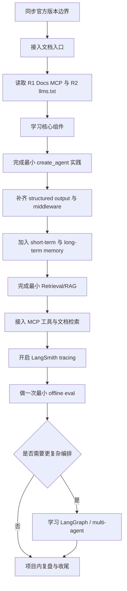

# 面向 Codex 项目的 LangChain 学习计划研究与 Markdown 草案

研究完成情况：19m · 9次引用 · 276个搜索（这段是人补充的）

结论：主线应围绕 LangChain v1 的 `create_agent`、memory、RAG、MCP 与 LangSmith，LangGraph 作为进阶扩展。 citeturn20view0turn13view1turn17search1turn26view0turn12search8

## 研究结论与设计依据

当前官方资料已经把 LangChain 的主学习面收束到 v1 语义：`create_agent` 是标准入口，`content_blocks` 是统一的消息内容接口，`langchain` 命名空间被精简为 agent 构建所需的核心能力，而旧式 chains、旧 retrievers、旧 hub 等遗留功能被明确迁到 `langchain-classic`。因此，这份学习计划不应再把旧版 chain/retriever 教程当作主线，而应把“识别旧资料边界”单列为一个兼容阅读主题。citeturn20view0

官方导航本身已经给出一条很清楚的“主题树”：核心组件包括 agents、models、messages、tools、short-term memory、structured output；进阶能力包括 middleware、runtime、context engineering、MCP、retrieval、long-term memory；工程化侧则是 LangSmith 的 tracing、observability、evaluation 与 deployment。对“系统学习 LangChain”的精简计划来说，最自然的组织方式不是先按时间分阶段，而是先按这些主题罗列清单，再为每个主题补最小目标、产出和代码实践。citeturn13view1turn16view0turn16view1turn16view2turn16view3turn14view2turn14view4turn15view0turn15view2turn15view3

框架边界也很适合直接写进计划文档：LangChain 负责“高度可配置的 agent harness”；LangGraph 负责“低层、长运行、状态化工作流/代理编排”；Deep Agents 则提供 planning、subagents、filesystem、context compression 等更高层的“开箱即用”能力。换言之，如果目标是“在 Codex 项目中系统学习 LangChain”，主线应放在 LangChain 自身；LangGraph 应放在“需要更强控制与编排时再进入”的邻接模块；Deep Agents 可作为理解上层抽象的参考，而不是必修起点。citeturn13view1turn12search8turn13view3turn21view1turn27search17

面向 Codex 的“可执行 Markdown”还有一个非常重要的官方依据：LangChain 文档站已经提供机器可读入口，包括 `llms.txt` 文档索引、docs MCP server，以及面向 Codex CLI 的官方接入命令。这意味着最终计划文件里最好显式保留“检索来源与优先级”一节，先让 agent 拿到最新官方文档入口，再展开具体主题，而不是把长篇说明直接塞进计划正文。citeturn26view0turn13view2

对 token 成本敏感时，官方资料给出的方向也很一致：上下文工程是可靠性的核心；长对话和长上下文会带来更高成本、更慢响应和更差表现；summarization、skills 的按需加载、provider tool search 的延迟暴露，以及 v1 中把 structured output 集成进主循环、从而省掉额外 LLM 调用，都是应当直接转译到学习计划写法里的信号。对应到 Markdown 文档，就是短句、一行一事、固定枚举、资源 ID 化、按需展开，而不是大段自然语言说明。citeturn19search6turn15view0turn16view3turn27search3turn14view1turn20view0

LangSmith 也不该被放到“学完再看”的末尾。官方将 tracing、observability、offline/online evaluation 放在同一生命周期里，并把评测流程拆成 dataset、evaluator、experiment、result analysis；对复杂 agent，官方还区分最终回答、轨迹与单步三种评估对象。对实际项目学习来说，至少应在计划中保留“最小 tracing”和“最小离线评测”两个显式条目。citeturn16view4turn17search1turn17search3turn17search5turn17search15

### 应纳入但先不展开的主题清单

| 主题 | 先列入的知识点 | 研究后的定位 |
| --- | --- | --- |
| 版本边界 | `create_agent`、`langchain-classic`、v1 命名空间 | 必修 |
| 核心组件 | models、messages、tools | 必修 |
| 输出与控制 | structured output、middleware、runtime | 必修 |
| 上下文与记忆 | context engineering、short-term memory、long-term memory | 必修 |
| 检索 | retrieval、2-step RAG、agentic RAG、hybrid RAG | 必修 |
| 协议与集成 | MCP、`langchain-mcp-adapters`、docs MCP | 必修 |
| 可靠性 | LangSmith tracing、observability、evaluation | 必修 |
| 进阶编排 | LangGraph、multi-agent、Deep Agents | 选修/按需 |
| UI 与部署 | Agent Chat UI、deployment | 未指定，默认留空 |

## 检索来源与优先级

从“让 Codex/agent 先拿到最新、最权威、最适合机器消费的资料”这个角度，检索顺序应先从官方文档入口开始，再下钻核心专题、工程化与仓库，最后看原始论文和中文补充。LangChain 官方已经把 MCP、`llms.txt`、docs、Academy、GitHub、LangSmith 组织成一套连贯入口；Python 官方文档提供了中文基础材料；原始论文则是理解 RAG、ReAct、Toolformer 等模式来源的最好补充。citeturn26view0turn20view0turn13view1turn17search1turn21view0turn21view1turn9search11turn30view0turn7search0turn6search1turn6search2

| 优先级 | 建议先检索的来源 | 用途 |
| --- | --- | --- |
| P0 | LangChain Docs MCP、`llms.txt`、`What's new in LangChain v1`、overview/quickstart/core pages | 锁定版本边界、主线 API、可机读文档入口 |
| P0 | LangSmith overview / observability / evaluation | 把 trace 与 eval 提前进学习闭环 |
| P1 | LangGraph overview / workflows and agents | 判断何时从 LangChain 进入更低层编排 |
| P1 | `langchain-ai/langchain`、`langchain-ai/langgraph`、`langchain-ai/langchain-mcp-adapters`、`langchain-ai/docs` | 看 README、仓库结构、官方示例与实现边界 |
| P1 | LangChain Academy 课程与课程仓库 | 获取官方练习路径与配套代码 |
| P1 | Python 官方中文文档、PEP 8 | 给 Java 开发者补 Python 最小语法/风格差异 |
| P2 | RAG、ReAct、Toolformer、Self-Refine 原始论文；MCP 官方规范 | 理解模式来源与协议层抽象 |
| P3 | 中文社区补充材料 | 仅做术语对照或快速预览，需二次核对版本 |

中文优先的可行做法不是“强行全中文”，而是“中文说明 + 英文官方原文标题”。本轮检索里，Python 基础层最适合使用官方中文文档；而 LangChain 核心资料主要仍来自英文官方 docs、GitHub 与 Academy；原始论文也应保留英文首发版本。citeturn30view0turn13view1turn21view0turn9search11turn7search0turn6search1turn6search2turn8search5

## 假设与未指定项

| 项目 | 状态 | 处理方式 |
| --- | --- | --- |
| 学习时长 | 未指定 | 结构中保留字段，不预设周数 |
| 学习深度 | 未指定 | 默认做到“能独立完成最小 agent、RAG、MCP、trace/eval”，更深部分单列选修 |
| 模型提供商 | 未指定 | 文档按 provider-agnostic 写法组织，示例保留可替换 provider 名称 |
| 部署/生产化 | 未指定 | 仅保留可选章节，不进入主线 |
| 前端/UI | 未指定 | 仅保留可选章节，不进入主线 |
| 数据源类型 | 未指定 | 实践以文本检索、简单工具、最小 RAG 为默认占位 |
| Python 小版本 | 未指定 | 文档只写宽松字段；若复用官方课程仓库，可优先 `uv` 与较新的 Python 3.12/3.13 环境 citeturn21view3turn21view4 |
| 学习者背景 | 已指定 | 视为 Java 开发者，需要单列 Python 注意点 |
| 旧教程兼容阅读 | 建议纳入 | 单列“旧资料识别”，避免把 `langchain-classic` 内容误当主线 citeturn20view0 |

面向 Java 开发者，最影响 LangChain 上手速度的通常不是“会不会写类”，而是 Python 的项目与表达习惯：用虚拟环境隔离依赖，类型标注便于 IDE/检查器但不在运行时强制，`dataclass` 适合轻量数据对象，`with` 对应 Java 的资源管理思路，而 LangChain 常见的 `ainvoke`/异步工具调用则要求理解 `asyncio` 的 `async/await` 模型。citeturn24search2turn32search12turn24search3turn32search9turn33search2

## 最终 Markdown 文档结构草案

下面的草案遵循三个原则：先锁版本边界，再按主题列知识点；把“目标/产出/实践/状态”压到同一主表里，避免重复 token；把长链接和长解释收束到资源表与变更表。之所以加入很短的“环境与命令”节，是因为官方 quickstart 已给出 `uv` 起步方式，而“Use docs programmatically”页面又给出了 Codex CLI 的 docs MCP 接法。citeturn13view2turn26view0turn21view3

````markdown
# LangChain 学习计划

## 环境与命令
```bash
codex mcp add langchain-docs --url https://docs.langchain.com/mcp
uv init
uv add langchain langgraph langchain-mcp-adapters
uv sync
```

## 元信息
| 字段 | 值 |
| --- | --- |
| 计划版本 | v0.1 |
| LangChain 基线 | v1 |
| 学习语言 | Python |
| 学习者背景 | Java 开发者 |
| 项目语境 | Codex project |
| 学习时长 | 未指定 |
| 学习深度 | 未指定 |
| 部署/生产化 | 未指定 |
| 前端/UI | 未指定 |
| 更新时间 | YYYY-MM-DD |

## 检索来源与优先级
> 状态枚举：未开始｜进行中｜已完成
> 时间格式：YYYY-MM-DD 或 YYYY-MM-DD HH:mm
> 资源引用：正文只写 R1/R2/R3，不在每行重复长链接

| ID | 优先级 | 来源 | 语言 | 用途 | 备注 |
| --- | --- | --- | --- | --- | --- |
| R1 | P0 | LangChain Docs MCP | EN | 让 Codex 检索最新官方文档 | 首选 |
| R2 | P0 | LangChain `llms.txt` | EN | 文档索引 | 首选 |
| R3 | P0 | What's new in LangChain v1 | EN | 锁定版本边界 | 必读 |
| R4 | P0 | LangChain overview / quickstart | EN | 建立主线 | 必读 |
| R5 | P0 | LangSmith overview / evaluation | EN | trace / eval | 必读 |
| R6 | P1 | LangGraph overview | EN | 进阶编排 | 选读 |
| R7 | P1 | Python 官方中文文档 | ZH | 补 Python 基础 | 必读 |
| R8 | P2 | RAG / ReAct / Toolformer | EN | 模式来源 | 选读 |

## 假设与未指定项
| 项目 | 值 | 说明 |
| --- | --- | --- |
| 学习时长 | 未指定 | 不预设周数 |
| 学习深度 | 未指定 | 先做到项目可用 |
| 模型提供商 | 未指定 | 示例采用可替换 provider |
| 部署/生产化 | 未指定 | 仅保留可选章节 |
| 前端/UI | 未指定 | 仅保留可选章节 |

## 知识点总表
| 主题 | 知识点 | 学习目标 | 产出 | 建议代码实践 | Java 开发者需注意的 Python 要点 | 状态 | 开始时间 | 完成时间 | 备注 |
| --- | --- | --- | --- | --- | --- | --- | --- | --- | --- |
| 版本边界 | `create_agent`、`langchain-classic` | 认清 v1 主线 | 最小脚手架 | 跑通 hello_agent.py | 导入路径以 v1 文档为准 | 未开始 |  |  |  |
| 核心组件 | models、messages、tools | 能写最小代理 | 双工具代理 | `search + calc` agent | tool 用 docstring + type hints | 未开始 |  |  |  |
| 结构化输出 | `response_format`、Pydantic | 返回稳定结构 | JSON / 模型对象 | 输出 `TaskPlan` | `dataclass` / Pydantic 类似轻量 POJO | 未开始 |  |  |  |
| 中间件 | middleware、runtime | 能加控制逻辑 | 带限制的 agent | 加 summarization / HITL / logging | 先理解函数式组合 | 未开始 |  |  |  |
| 上下文工程 | prompt、tool context、life-cycle context | 知道如何控成本与控行为 | 一套上下文策略 | 精简 system prompt + 资源按需加载 | 长说明放资源表，不放主表 | 未开始 |  |  |  |
| 记忆 | short-term、long-term | 区分线程内/跨线程记忆 | 可复用记忆样例 | `checkpointer + store` 最小例子 | `with`、`async` 用法要熟 | 未开始 |  |  |  |
| 检索 | retrieval、RAG | 能做最小知识问答 | 最小 RAG | 文本切分 + embeddings + retrieval | 先做 2-step，再做 agentic | 未开始 |  |  |  |
| MCP | docs MCP、`langchain-mcp-adapters` | 接入外部工具/文档 | MCP 样例 | 让 agent 调 MCP server | 先跑通 stdio，再看 http | 未开始 |  |  |  |
| 可观测性 | tracing、evaluation | 会定位问题与回归验证 | trace + mini eval | LangSmith 记录一次完整实验 | 不要只看最终答案，也看轨迹 | 未开始 |  |  |  |
| 进阶编排 | LangGraph、multi-agent | 按需进入低层编排 | 可选扩展 | Router / subagent 样例 | 默认不提前展开 | 未开始 |  |  |  |

## 变更记录
| 时间 | 作者 | 变更原因 | 变更内容 | 影响范围 |
| --- | --- | --- | --- | --- |
| YYYY-MM-DD HH:mm |  |  |  |  |

## 推荐资源
| ID | 名称 | 类别 | 语言 | 优先级 | 备注 |
| --- | --- | --- | --- | --- | --- |
| R1 | LangChain Docs MCP | 官方文档入口 | EN | P0 | 供 agent 检索 |
| R3 | What's new in LangChain v1 | 官方 release | EN | P0 | 锁版本边界 |
| R4 | LangChain overview / agents / tools / memory / retrieval | 官方 docs | EN | P0 | 主线资料 |
| R5 | LangSmith overview / evaluation / observability | 官方 docs | EN | P0 | trace / eval |
| R6 | LangGraph overview / workflows and agents | 官方 docs | EN | P1 | 进阶 |
| R7 | Python 官方中文文档 / PEP 8 | 官方 docs / 规范 | ZH/EN | P1 | Python 补课 |
| R8 | RAG / ReAct / Toolformer / MCP spec | 原始论文 / 官方规范 | EN | P2 | 模式来源 |

## Token 成本敏感写法
| 规则 | 建议 |
| --- | --- |
| 行粒度 | 一行只写一件事 |
| 目标/产出 | 各控制在 8–16 字 |
| 备注 | 只写阻塞、偏差、决策，不写复述 |
| 资源引用 | 用 R1/R2，不重复粘贴链接 |
| 状态字段 | 仅用固定枚举 |
| 可选主题 | 未指定就保留空节，不展开 |
````

### 精简写法建议

真正省 token 的，不是删掉关键字段，而是让字段“短而稳定”。官方资料已经表明，可靠性和成本都深受上下文长度、工具暴露方式、结构化输出策略以及是否多走额外 LLM 调用影响；因此计划文件应尽量把解释性长文本移到资源表，把执行性短文本留在主表。citeturn15view0turn16view3turn14view1turn20view0

| 场景 | 精简写法 |
| --- | --- |
| 状态 | 只用 `未开始 / 进行中 / 已完成` |
| 日期 | 统一 `YYYY-MM-DD` 或 `YYYY-MM-DD HH:mm` |
| 资源 | 用 `R#` 代替长链接 |
| 目标 | 动宾短语，如“跑通最小代理” |
| 产出 | 文件/脚本名或可验证对象名 |
| 备注 | 只记偏差、阻塞、下次动作 |
| 未指定项 | 明写“未指定”，不臆造默认值 |
| 可选主题 | `可选` 或空白，不写长段解释 |

## 可直接作为 Markdown 文件的示例片段

下例保留了最小可执行命令、v1 基线、知识点主表和变更记录模板，已经足够作为项目仓库中的 `LANGCHAIN_PLAN.md` 初稿。其中接入 Codex 的 docs MCP 命令和 `uv` 起步方式都来自官方页面。citeturn26view0turn13view2turn21view3turn20view0

````markdown
# LangChain 学习计划

## 环境与命令
```bash
codex mcp add langchain-docs --url https://docs.langchain.com/mcp
uv init
uv add langchain langgraph langchain-mcp-adapters
uv sync
```

## 元信息
- 基线：LangChain v1
- 学习者：Java 开发者
- 学习时长：未指定
- 部署/生产化：未指定

## 知识点总表
| 主题 | 知识点 | 目标/产出 | 代码实践 | Python 要点 | 状态 | 开始时间 | 完成时间 | 备注 |
| --- | --- | --- | --- | --- | --- | --- | --- | --- |
| 版本边界 | create_agent、langchain-classic | 识别 v1 主线 | 跑通 hello_agent.py | 导入路径先查官方 v1 文档 | 未开始 |  |  |  |
| 核心组件 | models、messages、tools | 能写双工具代理 | 实现 search + calc agent | 工具描述优先写 docstring，参数写类型标注 | 未开始 |  |  |  |
| 结构化输出 | response_format、Pydantic | 返回稳定 JSON | 输出 TaskPlan 模型 | dataclass/Pydantic 可视作轻量 POJO | 未开始 |  |  |  |

## 变更记录
| 时间 | 作者 | 变更原因 | 影响范围 |
| --- | --- | --- | --- |
````

## Mermaid 学习流程

这个流程先锁定 v1 版本边界，再进入核心组件、最小代理、上下文/记忆、RAG、MCP 与 trace/eval，最后才按需扩展到 LangGraph 或多代理，符合官方对 LangChain、LangGraph、LangSmith 以及评测生命周期的定位。citeturn20view0turn13view1turn12search8turn17search1turn17search3

