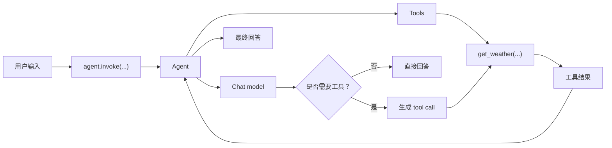

# LC-02 最小 agent

## 当前目标

本节目标是跑通一个最小 LangChain v1 agent：它能接收用户问题，必要时调用一个 Python 工具函数，然后返回最终回答。

先不要追求复杂工程结构。LC-02 只需要看懂这条主线：

```text
用户消息 -> agent -> 模型判断是否需要工具 -> 调用工具 -> 模型生成最终回答
```

## 官方资料确认

- LangChain quickstart：<https://docs.langchain.com/oss/python/langchain/quickstart>
- LangChain v1 迁移说明：<https://docs.langchain.com/oss/python/migrate/langchain-v1>

已确认的 v1 入口：

```python
from langchain.agents import create_agent
```

`create_agent` 可以直接接收：

- `model`：模型字符串或模型对象。
- `tools`：工具列表，可以是带类型标注和 docstring 的 Python 函数。
- `system_prompt`：系统提示词，用来约束 agent 的行为。

调用 agent 时，官方示例使用消息列表：

```python
agent.invoke(
    {"messages": [{"role": "user", "content": "北京今天适合跑步吗？"}]}
)
```

这段写法可以拆成两层看：

```python
{
    "messages": [
        {"role": "user", "content": "北京今天适合跑步吗？"}
    ]
}
```

外层的 dict 是 agent 的输入状态。`create_agent(...)` 创建出来的 agent 不只关心一条 prompt，它内部还要维护消息流、工具调用、中间结果、最终回答等状态，所以输入通常用 dict 表达。

`"messages"` 是其中最核心的字段，表示这次交给 agent 的对话消息列表。列表里的每一项是一条消息，可以先用这种 dict 形式写：

| 字段 | 含义 |
| --- | --- |
| `role` | 消息角色，例如 `user` 表示用户输入 |
| `content` | 消息内容，也就是用户真正问的问题 |

所以这句代码的意思不是“传一个叫 messages 的普通参数”，而是：

```text
把一组对话消息作为 agent 当前输入状态交给 LangChain 执行。
```

最小阶段先记住两点：

- 调 agent 时，常用 `agent.invoke({"messages": [...]})`。
- 看结果时，也常从 `result["messages"]` 里取最终消息或中间消息。

注意：`create_agent(...)` 创建出来的 agent 不支持像 chat model 一样直接传字符串：

```python
agent.invoke("你好")  # 不支持
```

在当前项目锁定的 `langchain==1.3.9` 中，这种写法会报类似 `Expected dict, got hi` 的错误。也就是说，字符串直传是 `model.invoke(...)` 的便利写法，不是 `agent.invoke(...)` 的输入格式。

## 核心概念

`create_agent` 像一个高层工厂方法。它帮你把模型、工具和运行循环组装起来。你不需要在 LC-02 手写“模型先判断、再调用工具、再继续回答”的循环，LangChain 会负责这部分。

`tools` 里的 Python 函数不是普通内部方法那么简单。它们会被暴露给模型，让模型根据函数名、参数类型和 docstring 判断什么时候调用。

所以工具函数至少要写清三件事：

- 函数名表达能力，例如 `get_weather`。
- 参数有类型标注，例如 `city: str`。
- docstring 说明用途，例如“返回指定城市的模拟天气”。

## Java 开发者视角

可以把最小 agent 类比成一个带插件能力的 service：

```text
AgentService
├── ChatModel client
├── List<Tool> tools
└── invoke(messages)
```

工具函数有点像被注册进容器的可调用 handler。不同的是，是否调用哪个工具不是你在业务代码里 `if/else` 决定，而是模型根据用户问题和工具描述来决定。

Python 的函数类型标注类似 Java 方法签名的一部分，但默认不会像 Java 编译器那样强制校验。LangChain 会读取这些标注来生成工具 schema，因此这里的类型标注对 agent 很重要。

## 图解

### 最小 agent 调用链



读图重点：

- `agent.invoke(...)` 是一次完整 agent 调用的入口。
- model 负责推理和决定是否需要工具。
- tools 是 agent 可以调用的外部能力，不是用户直接调用的函数。

## 本节手写任务

请在 `learning/LC_02_minimal_agent/hello_agent.py` 里亲手补全三处：

1. 在 `get_weather(city: str)` 中返回一段模拟天气文本。
2. 把 `MODEL = "TODO:provider:model-name"` 改成你当前可用的模型。
3. 在 `main()` 中调用 `agent.invoke(...)`，并打印最后一条消息内容。

建议先用一个会触发工具的问题：

```text
北京今天适合跑步吗？
```

如果 agent 正确调用工具，你应该能看到最终回答里包含你在 `get_weather` 中返回的天气信息。

## 本次实践记录

本节已完成最小 agent 的完整闭环：

- 使用 Python 3.12 和 `uv sync` 恢复项目虚拟环境。
- PyCharm 解释器指向项目 `.venv`。
- 安装并使用 `langchain-openai`。
- 因 OpenAI API 账户没有可用额度，改用 DeepSeek 的 OpenAI-compatible API。
- 使用 `ChatOpenAI(..., base_url="https://api.deepseek.com")` 创建模型对象，再传给 `create_agent`。
- 通过 `agent.invoke(...)` 跑通请求，并通过 `result["messages"]` 查看消息流和最终回答。

本节出现过的关键报错和含义：

- `ModuleNotFoundError: No module named 'langchain'`：依赖没有安装到当前项目虚拟环境。
- `Missing credentials`：没有配置对应 provider 的 API key。
- `insufficient_quota`：OpenAI API 账户没有可用额度，不是代码错误。
- `Authentication Fails`：DeepSeek key 配置或复制有误。

## 本节总结

LC-02 的核心不是“天气工具”本身，而是理解 LangChain v1 agent 的最小运行形状：

```text
create_agent(model, tools, system_prompt) -> agent.invoke(...) -> result["messages"]
```

其中 `result["messages"][-1].content` 通常是最终回答；中间消息可以帮助观察模型是否请求了工具、工具返回了什么、模型如何基于工具结果组织最终回答。

`langchain-openai` 不只用于 OpenAI 官方模型。只要 provider 提供 OpenAI-compatible API，通常也可以通过 `ChatOpenAI` 配置 `base_url` 和对应 API key 接入。

## 建议 Git commit message

```text
LC-02：跑通最小 agent 与工具调用
```
