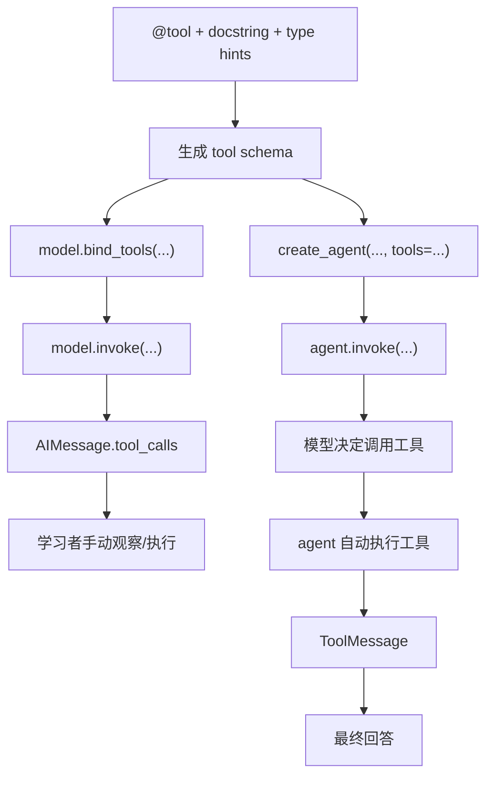

# LC-05：Tools

## 本阶段目标

这一阶段开始让 agent 从“只会说”进入“会调用工具”。学完后，你应该能回答四个问题：

1. LangChain v1 里的 tool 是什么？
2. `@tool` 装饰器、函数名、docstring、type hints 分别有什么作用？
3. 模型提出的 `tool_calls` 和工具返回的 `ToolMessage` 如何连接？
4. 什么时候交给 `create_agent(...)` 自动执行工具，什么时候手动观察工具调用流程？

## 官方资料核对

已核对 LangChain 官方文档：

- Tools：<https://docs.langchain.com/oss/python/langchain/tools>
- Models / Tool calling：<https://docs.langchain.com/oss/python/langchain/models#tool-calling>

关键结论：

- 工具本质上是带有清晰输入输出定义的可调用函数，agent 可以借助它查询数据、执行代码或调用外部系统。
- 官方当前推荐的最小工具定义方式是 `from langchain.tools import tool`，然后用 `@tool` 装饰普通 Python 函数。
- 工具函数的 type hints 很重要：它们会参与生成工具输入 schema，帮助模型知道应该传什么参数。
- 工具函数的 docstring 会成为工具描述的一部分，模型会根据描述判断什么时候使用工具。
- 工具名默认来自函数名。为了 provider 兼容性，工具名优先使用 `snake_case`，避免空格和特殊符号。
- 单独使用 chat model 时，需要先 `model.bind_tools([...])`，再手动执行 `AIMessage.tool_calls` 里的工具调用，并把结果作为 `ToolMessage` 放回消息列表。
- 使用 `create_agent(...)` 时，agent loop 会自动处理“模型请求工具 -> 执行工具 -> 把结果交回模型 -> 生成最终回答”的循环。
- `config` 和 `runtime` 是保留参数名，不要把它们当作普通工具入参；运行期上下文会放到 LC-07 Runtime 再系统学习。

## 核心概念

### tool 是模型可选择调用的函数

一个普通模型只能基于上下文生成文本。绑定工具之后，模型多了一个选择：当它发现自己需要外部信息或确定性计算时，可以先提出工具调用请求。

工具通常包含两部分：

| 部分 | 作用 |
| --- | --- |
| schema | 告诉模型工具叫什么、做什么、需要哪些参数 |
| function | 程序真正执行的 Python 函数或协程 |

可以先把 tool 理解成“给模型看的函数说明书 + 给程序跑的函数实现”。

### `@tool` 装饰器

最小写法如下：

```python
from langchain.tools import tool


@tool
def search_notes(query: str) -> str:
    """Search study notes by keyword."""
    return "..."
```

这里有三个信息会影响模型：

| 信息 | 来自哪里 | 影响 |
| --- | --- | --- |
| 工具名 | 函数名 `search_notes` | 模型请求调用时使用的名字 |
| 工具描述 | docstring | 模型判断何时使用工具 |
| 参数 schema | type hints，例如 `query: str` | 模型生成参数时参考 |

LC-05 阶段先用 `@tool` 掌握普通函数工具。更复杂的 Pydantic schema 会放到 LC-06 Structured Output 和后续阶段继续展开。

## tool calling 的两条路径

### 路径一：agent 自动执行工具

这是最常用的业务路径：

```python
from langchain.agents import create_agent

agent = create_agent(
    model=model,
    tools=[search_notes, calculator],
    system_prompt="你是一个会按需使用工具的学习助手。",
)

result = agent.invoke({
    "messages": [
        {"role": "user", "content": "查一下 LC-04 学了什么，再计算 12 * 8。"}
    ]
})
```

你不需要手动拼 `ToolMessage`，agent loop 会处理工具执行和消息回填。阶段练习的主线就走这条。

### 路径二：手动观察模型工具调用

这是理解底层流程时很有价值的路径：

```python
model_with_tools = model.bind_tools([search_notes, calculator])
ai_message = model_with_tools.invoke("计算 12 * 8")

print(ai_message.tool_calls)
```

如果 `tool_calls` 不为空，说明模型不是直接回答，而是提出了工具调用请求。每个调用里通常能看到：

| 字段 | 含义 |
| --- | --- |
| `name` | 要调用的工具名 |
| `args` | 模型生成的参数 |
| `id` | 本次工具调用 ID，用来和后续 `ToolMessage.tool_call_id` 对齐 |

手动流程有助于理解 LC-04 留下的问题：`AIMessage.tool_calls` 为什么存在，以及 `ToolMessage` 为什么需要 `tool_call_id`。

## 图解

### Tool calling 的两条路径



读图重点：

- `@tool`、docstring 和 type hints 共同影响工具 schema。
- `model.bind_tools(...)` 适合观察模型“想调用什么”。
- `create_agent(..., tools=...)` 会把工具执行也纳入 agent loop。

## 本阶段手写实践任务

请你亲手完成 `learning/LC_05_tools/tool_calling_skeleton.py`：

1. 定义 `search_notes(query: str) -> str` 工具。
   - 用一个本地 dict 或 list 模拟学习资料库。
   - 根据关键词返回匹配内容。
   - 没有匹配时返回清晰提示。
2. 定义 `calculator(expression: str) -> str` 工具。
   - 支持简单四则运算即可。
   - 建议先限制输入范围，不要直接对用户输入使用 `eval(...)`。
   - 出错时返回说明，而不是让异常直接炸出工具。
3. 用 `create_agent(...)` 创建双工具 agent。
4. 调用 agent，让它同时完成“查资料”和“计算”。
5. 可选：用 `model.bind_tools(...)` 打印一次 `AIMessage.tool_calls`，观察模型生成的工具名和参数。

建议问题：

```text
请先查一下 LC-04 Messages 主要学了什么，再计算 18 * 7 + 6，并用两句话总结。
```

## Python 要点：docstring、type hints、异常处理

### docstring

docstring 是函数定义下面的三引号字符串：

```python
def search_notes(query: str) -> str:
    """Search study notes by keyword."""
```

在普通 Python 里，它常用于文档说明；在 LangChain tool 里，它还会影响模型是否知道该什么时候调用这个工具。写工具 docstring 时要清楚说明“这个工具能做什么”，不要写太空泛。

### type hints

type hints 是参数和返回值上的类型标注：

```python
def calculator(expression: str) -> str:
    ...
```

它们不是普通运行时校验。也就是说，写了 `expression: str` 并不等于 Python 会自动拒绝所有非字符串输入。但 LangChain 会用这些标注生成工具 schema，所以工具函数缺少类型标注时，模型更难稳定生成正确参数。

### 异常处理

工具被 agent 调用时，异常会影响整条 agent 流程。学习阶段可以先在工具内部捕获常见错误，返回可读文本：

```python
try:
    ...
except ValueError as exc:
    return f"计算失败：{exc}"
```

这样模型拿到的是一条可读的工具结果，而不是程序直接中断。更系统的 tool error handling 会在 Middleware 和工程化阶段继续展开。

## 常见坑

- 工具没有 docstring。模型可能不知道工具用途，或者 LangChain 无法构造清晰描述。
- 工具参数缺少 type hints。schema 不清楚，模型生成参数更容易漂。
- 工具名带空格或奇怪符号。优先使用 `snake_case`。
- 把 `tool_calls` 当成最终回答。它只是模型提出的行动请求，不是工具执行结果。
- 使用 model 手动绑定工具后，忘记执行工具并把结果传回模型。
- 使用 `create_agent(...)` 时，又自己重复手动执行工具，导致流程混乱。
- calculator 直接 `eval(...)` 用户输入。学习阶段可以用受限解析，至少不要把这个写法当成生产习惯。
- 工具函数直接抛出异常。先把错误转成模型能读懂的字符串，排错会更顺。

## 本阶段完成标准

- 能用 `@tool` 定义至少两个工具。
- 能解释工具名、docstring、type hints 与 schema 的关系。
- 能用 `create_agent(...)` 把多个工具交给 agent 使用。
- 能看懂 `AIMessage.tool_calls` 里的 `name`、`args`、`id`。
- 能说清 agent 自动工具循环和手动 `bind_tools(...)` 观察流程的区别。
- 能对工具中的常见错误做基本异常处理。

## 当前推进记录

2026-06-14：

本阶段已启动，已创建 LC-05 学习文档和手写实践骨架。下一步建议你先补全 `tool_calling_skeleton.py` 里的两个工具函数，再手动运行观察 agent 是否会按需调用 `search_notes` 和 `calculator`。

## 实践复盘

2026-06-15：

本阶段你已经补全 `learning/LC_05_tools/tool_calling_skeleton.py`，完成了 LC-05 的最小工具调用闭环：

1. 用 `@tool` 定义了 `search_notes(query: str) -> str`。
2. 用 `STUDY_NOTES` 作为本地学习资料库，模拟一个最小 search 工具。
3. 用 `@tool` 定义了 `calculator(expression: str) -> str`。
4. 给 calculator 增加了字符白名单、正则检查和异常捕获，开始把工具错误转成模型可读的字符串。
5. 用 `model.bind_tools([search_notes, calculator])` 观察模型生成的 `AIMessage.tool_calls`。
6. 用 `create_agent(...)` 创建双工具 agent，让 agent 自动完成“模型请求工具 -> 执行工具 -> 回填工具结果 -> 生成最终回答”的流程。
7. 通过 `result["messages"]` 观察完整消息流，理解最终回答通常在 `result["messages"][-1]`。

这次实践的关键价值不是工具本身复杂，而是你亲眼看到了两种层次：

| 观察方式 | 看到什么 | 适合场景 |
| --- | --- | --- |
| `model.bind_tools(...).invoke(...)` | 模型想调用哪些工具、参数是什么 | 学习 tool calling 底层结构 |
| `agent.invoke({"messages": [...]})` | agent 自动调用工具后的完整消息流 | 实际业务主路径 |

## 关键问题补充

### `system_prompt` 和 `SystemMessage` 的区别

在 `create_agent(...)` 中写：

```python
create_agent(
    model=model,
    tools=[search_notes, calculator],
    system_prompt="你是一个简洁的中文学习助手。需要查资料或计算时，请优先使用工具。",
)
```

可以先理解为：给这个 agent 配置一条固定的系统级行为规则。它会被 agent 放入运行上下文，用来影响模型每次决策。

而 `SystemMessage` 是你手动构造消息列表时使用的消息对象：

```python
messages = [
    SystemMessage(content="你是一个简洁的中文学习助手。"),
    HumanMessage(content="你好"),
]
```

两者都能表达系统规则，但使用位置不同：

| 写法 | 常见位置 | 关注点 |
| --- | --- | --- |
| `system_prompt=...` | `create_agent(...)` | agent 级固定规则，适合工具 agent |
| `SystemMessage(...)` | `model.invoke(messages)` 或手写消息流 | 手动控制 message 列表 |

LC-05 先用 `system_prompt` 即可；等后续学习上下文工程和 memory 时，再细看系统提示词如何进入完整消息上下文。

### `agent.invoke(...)` 输出太乱怎么办

直接打印整个 `result` 会很吵：

```python
print(result)
```

更适合学习观察的是逐条打印消息：

```python
for message in result["messages"]:
    message.pretty_print()
```

如果只想看最终回答：

```python
result["messages"][-1].pretty_print()
```

这里的 `result["messages"][-1]` 表示取消息列表的最后一条，通常就是 agent 的最终回答。`[-1]` 是 Python list 的倒数第一个元素。

### `eval(...)` 的边界

本阶段 calculator 里使用 `eval(expression)` 是学习阶段的最小实现选择，但不要把它当成生产习惯。即使前面做了字符白名单和正则限制，生产环境中也更推荐使用专门的表达式解析器、AST 白名单解析，或者直接调用受控计算服务。

本阶段更重要的是理解工具错误处理思路：

```python
try:
    ...
except Exception as exc:
    return f"计算失败：{exc}"
```

工具函数返回可读错误，比让异常直接中断 agent 流程更适合学习和调试。

## 阶段总结

LC-05 把前面几节串起来了：

1. LC-03 的 model 配置负责创建可复用模型。
2. LC-04 的 messages 让你能看懂 agent 运行后的消息流。
3. LC-05 的 tools 让模型不只生成文本，还能提出工具调用请求。

本阶段最重要的结论：

1. `@tool` 会把普通 Python 函数包装成模型可理解的工具。
2. 函数名、docstring、type hints 会影响工具 schema，也会影响模型是否能稳定调用工具。
3. `model.bind_tools(...)` 适合观察模型提出的 `tool_calls`，但不会自动执行工具。
4. `create_agent(...)` 会自动管理工具调用循环，是实际使用工具 agent 的主路径。
5. `agent.invoke(...)` 的输入应是包含 `"messages"` 的状态 dict，不支持直接传字符串。
6. `result["messages"]` 里能看到用户消息、AI 工具调用消息、工具结果消息和最终 AI 回答。
7. 打印 agent 结果时优先用 `message.pretty_print()`，不要直接 `print(result)`。
8. 工具内部要考虑输入为空、参数不符合预期、执行失败等情况，把错误转成清晰文本更容易排查。

LC-05 的目标已经达成：你已经能写自定义工具，并能观察模型 tool calling 与 agent 自动工具循环的差异。

## 建议 Git commit message

```text
LC-05：完成 Tools 阶段学习
```
