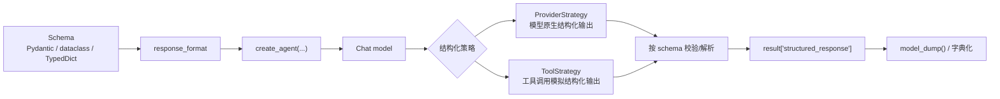

# LC-06：Structured Output

## 本阶段目标

这一阶段开始让 agent 从“生成一段自然语言”进入“返回一个稳定的数据结构”。学完后，你应该能回答四个问题：

1. `response_format` 是什么，为什么它比手写 JSON prompt 更可靠？
2. Pydantic `BaseModel`、字段类型和 `Field(...)` 约束分别起什么作用？
3. `result["structured_response"]` 和 `result["messages"][-1]` 有什么区别？
4. `ProviderStrategy` 和 `ToolStrategy` 应该怎么选？

## 官方资料核对

已核对官方文档：

- LangChain Structured output：<https://docs.langchain.com/oss/python/langchain/structured-output>
- Pydantic Models：<https://docs.pydantic.dev/latest/concepts/models/>
- Pydantic Fields：<https://docs.pydantic.dev/latest/concepts/fields/>

关键结论：

- LangChain v1 的 `create_agent(...)` 可以通过 `response_format` 请求结构化输出。
- 最终结构化结果会放在 agent 返回状态的 `structured_response` key 中。
- `response_format` 可以接收 schema 类型、`ProviderStrategy[...]`、`ToolStrategy[...]` 或 `None`。
- 直接传 Pydantic 类时，LangChain 会根据模型能力自动选择 provider-native structured output 或 tool calling 策略。
- provider 原生结构化输出通常更可靠；不支持原生结构化输出时，可使用 `ToolStrategy` 走工具调用路径。
- schema 支持 Pydantic model、dataclass、TypedDict、JSON Schema；`ToolStrategy` 还支持 Union 类型。
- Pydantic model 是继承 `BaseModel` 的类，字段由 Python 类型标注定义，可配合 `Field(...)` 增加描述、默认值和校验约束。
- Pydantic 的“校验”更准确地说是把输入解析并生成符合类型和约束的模型实例；必要时它可能进行类型转换。

## 核心概念

### structured output 解决什么问题

如果让模型自然回答：

```text
请给我一个学习计划。
```

它可能返回一段很好读的文字，但程序很难稳定提取“标题、优先级、步骤”。你可以要求它“请输出 JSON”，但这仍然只是 prompt 约定：字段可能缺失，类型可能漂移，格式也可能夹杂解释文字。

Structured output 的目标是把输出契约前移到代码里：

```python
class TaskPlan(BaseModel):
    title: str
    priority: Literal["low", "medium", "high"]
    steps: list[str]
```

这样你期待的不是一段“看起来像 JSON 的文字”，而是一个能被校验并直接使用的 `TaskPlan` 对象。

### `response_format`

在 `create_agent(...)` 中，`response_format` 用来声明最终输出 schema：

```python
agent = create_agent(
    model=model,
    tools=[],
    response_format=TaskPlan,
)
```

调用后重点看：

```python
result = agent.invoke({"messages": [{"role": "user", "content": question}]})
print(result["structured_response"])
```

`result["messages"]` 仍然记录完整对话过程；`result["structured_response"]` 才是本阶段要重点观察的稳定结构。

### ProviderStrategy 和 ToolStrategy

| 策略 | 含义 | 适合场景 |
| --- | --- | --- |
| `ProviderStrategy(Schema)` | 使用模型服务商原生结构化输出能力 | provider 明确支持 structured output |
| `ToolStrategy(Schema)` | 把 schema 作为一种工具调用来生成结构 | provider 不支持原生结构化输出，但支持 tool calling |
| 直接传 `Schema` | 让 LangChain 自动选择策略 | 学习阶段和大多数默认场景 |

本项目当前使用 OpenAI-compatible provider。不同 provider 对原生结构化输出的支持可能不同，所以练习时建议两条路径都观察：

1. `response_format=TaskPlan`
2. `response_format=ToolStrategy(StudySummary)`

如果第一条路径不稳定，先不用急着改环境；这本身就是一个有价值的学习点：结构化输出不是只看 LangChain API，也依赖模型 provider 的能力边界。

## Pydantic 最小知识

### `BaseModel`

Pydantic model 是一个继承 `BaseModel` 的类：

```python
from pydantic import BaseModel


class StudySummary(BaseModel):
    topic: str
    key_points: list[str]
```

字段通过类型标注声明。实例创建成功后，可以像普通对象一样访问属性：

```python
summary.topic
summary.key_points
```

如果要转成 dict，用 Pydantic v2 的 `model_dump()`：

```python
summary.model_dump()
```

如果用 Java / Spring 的经验类比，可以先这样理解：

| Pydantic | Java / Spring 近似概念 |
| --- | --- |
| `BaseModel` 子类 | DTO / Request 类 |
| 字段类型标注 | Java 字段类型 |
| `Field(...)` | Bean Validation 注解的一部分能力，例如 `@NotBlank`、`@Size` |
| 创建 `TaskPlan(...)` | 把外部输入反序列化并绑定成对象 |
| `ValidationError` | 参数绑定或校验失败 |
| `model_dump()` | DTO 转成 Map / JSON-ready dict |

所以 `Pydantic BaseModel` 不完全等于 `@RequestBody`。更准确地说，它接近“DTO + 反序列化 + 校验”的组合；而 `@RequestBody` 更像 Spring MVC 中把 HTTP 请求体绑定到 DTO 参数上的注解。

### `Field(...)`

`Field(...)` 可以补充字段说明和约束：

```python
from pydantic import Field


class TaskPlan(BaseModel):
    title: str = Field(description="Short task title")
    steps: list[str] = Field(min_length=1, description="Actionable steps")
```

对 LangChain 来说，`description` 很重要：它会进入 schema，帮助模型理解每个字段应该填什么。

常见约束：

| 约束 | 示例 | 含义 |
| --- | --- | --- |
| 必填 | `Field(...)` 或 `Field(description="xxx")` | `...` 表示没有默认值、字段必填；Pydantic v2 里不写默认值时，也仍然是必填字段 |
| `min_length` | `Field(min_length=1)` | 字符串或列表最小长度 |
| `max_length` | `Field(max_length=5)` | 字符串或列表最大长度 |
| `ge` | `Field(ge=1)` | 数字大于等于 |
| `le` | `Field(le=5)` | 数字小于等于 |

判断字段是否必填时，重点看有没有默认值，而不是看有没有 `description`：

```python
title: str = Field(description="任务标题")
```

这仍然是必填，因为没有默认值。下面这个才是可不传：

```python
title: str = Field(default="", description="任务标题")
```

即使类型写成 `str | None`，如果没有默认值，也仍然是必填，只是允许传入 `None`：

```python
title: str | None = Field(description="任务标题")
```

要表达“可不传，默认就是空”，需要显式写默认值：

```python
title: str | None = Field(default=None, description="任务标题")
```

### `Literal`

如果字段只能是几个固定值，可以用 `Literal`：

```python
from typing import Literal


priority: Literal["low", "medium", "high"]
```

这比写成普通 `str` 更稳定，因为模型和校验器都能看到可选范围。

## 图解

### Structured output 输出链路



读图重点：

- schema 是结构化输出的契约。
- `response_format` 把 schema 接到 agent 输出协议上。
- 最终读取重点通常是 `structured_response`，而不是自由文本。

## 本阶段手写实践任务

请你亲手完成 `learning/LC_06_structured_output/structured_output_skeleton.py`：

1. 补全 `TaskPlan`：
   - `title: str`
   - `priority: Literal["low", "medium", "high"]`
   - `steps: list[str]`
2. 给字段添加合适的 `Field(...)` 描述和至少一个简单约束。
3. 补全 `StudySummary`：
   - `topic: str`
   - `key_points: list[str]`
   - `next_action: str`
4. 在 `build_study_summary_agent()` 中使用 `ToolStrategy(StudySummary)`。
5. 在 `inspect_structured_response(...)` 中打印：
   - `result["structured_response"]`
   - `result["messages"][-1].pretty_print()`
   - `structured_response.model_dump()`
6. 手动运行脚本，观察直接 schema 和 `ToolStrategy(...)` 两条路径的差异。

建议先只跑 `TaskPlan`，跑通后再解开 `StudySummary`。如果 provider 对结构化输出支持不稳定，优先记录错误信息，我们再一起判断是 schema 写法问题、provider 能力问题，还是 prompt 约束不够清晰。

## 常见坑

- 只在 prompt 里写“请返回 JSON”，但没有使用 `response_format`。
- Pydantic 字段缺少 `description`，模型不知道字段语义。
- 把所有字段都写成 `str`，导致结构看起来稳定、语义却不稳定。
- 忘记看 `result["structured_response"]`，还在 `messages` 里找最终结构。
- 直接 `print(result["messages"][-1])`，输出对象表示比较吵；学习观察时优先用 `result["messages"][-1].pretty_print()`。
- provider 不支持原生结构化输出时，没有尝试 `ToolStrategy(...)`。
- 误以为 Pydantic type hints 等于 Python 自动静态类型检查。Pydantic 是运行时解析和校验，Python 类型标注本身不会强制运行时类型。
- `list[str]` 里混入太长的自然语言段落。结构化输出字段应该短、清楚、便于程序继续处理。

## 本阶段完成标准

- 能用 Pydantic `BaseModel` 定义至少两个结构化输出 schema。
- 能解释 `Field(description=...)` 为什么会影响模型输出质量。
- 能用 `create_agent(..., response_format=...)` 获取 `structured_response`。
- 能把 Pydantic 对象通过 `model_dump()` 转成 dict。
- 能说清直接传 schema、`ProviderStrategy`、`ToolStrategy` 的区别。
- 能初步判断结构化输出失败时应该看 schema、provider 能力还是模型生成内容。

## 当前推进记录

2026-06-15 11:48：

LC-06 已启动。已创建阶段学习文档和手写骨架，并按官方文档核对 `response_format`、`structured_response`、ProviderStrategy、ToolStrategy、Pydantic model 与字段约束。下一步建议你先补全 `TaskPlan`，再手动运行脚本观察 `structured_response`。

## 实践复盘

2026-06-15 15:23：

本阶段你已经补全 `learning/LC_06_structured_output/structured_output_skeleton.py`，完成了两套结构化输出练习：

1. 定义 `TaskPlan(BaseModel)`，包含 `title`、`priority`、`steps` 三个字段。
2. 用 `Literal["low", "medium", "high"]` 限制优先级只能取固定值。
3. 用 `Field(...)` 给字段添加 `description`、`min_length`、`max_length` 等说明和约束。
4. 定义 `StudySummary(BaseModel)`，包含 `topic`、`key_points`、`next_action`。
5. 用 `response_format=TaskPlan` 观察 LangChain 自动选择结构化输出策略。
6. 用 `response_format=ToolStrategy(StudySummary)` 观察工具策略生成结构化输出。
7. 从 `result["structured_response"]` 取出 Pydantic 对象，并用 `model_dump()` 转成 dict。
8. 打印最终 message 时使用 `result["messages"][-1].pretty_print()`，比直接 `print(...)` 更清晰。

这次练习的重点不是让模型回答得更漂亮，而是让程序拿到更稳定的对象结构。自然语言回答适合人读；`structured_response` 更适合后续代码继续处理。

## 关键问题补充

### schema 的 docstring 是否像 tool 一样必须

不必须。tool 函数的 docstring 更接近工具说明，模型会根据它判断什么时候调用工具；因此 LC-05 里 tool docstring 很关键。

Pydantic schema 的 class docstring 主要提升整体可读性。对结构化输出更关键的是每个字段的 `Field(description=...)`，因为模型最终要填的是字段。字段描述越清楚，输出越稳定。

### `Field(...)` 中的 `...` 和必填字段

`Field(..., description="xxx")` 里的 `...` 是 Python 的省略号对象，可以先理解成“没有默认值，字段必填”。

在 Pydantic v2 中，如果字段没有默认值，即使写成 `Field(description="xxx")`，它仍然是必填字段。`description` 只是字段说明，不决定是否必填。

判断规则可以简化成：

```text
没有默认值 -> 必填
有默认值 -> 可不传
```

### DeepSeek V4 Pro thinking mode 与 `tool_choice`

本阶段实践中遇到过这个错误：

```text
openai.BadRequestError: Error code: 400 - Thinking mode does not support this tool_choice
```

原因是 DeepSeek V4 Pro 默认可能启用 thinking mode，而 LangChain structured output 在当前 provider 能力边界下可能通过 tool calling 实现，这会让请求携带 `tool_choice`。当前 DeepSeek thinking mode 不支持这个组合。

本项目的最小解决方式是在模型配置中关闭 thinking：

```python
extra_body={"thinking": {"type": "disabled"}}
```

这个改动适合 LC-05 Tools、LC-06 Structured Output 这类需要 tool calling / structured output 的学习阶段。纯问答、推理和总结场景可以再按需要开启 thinking。

## 阶段总结

LC-06 的核心收获：

1. `response_format` 是 LangChain v1 中声明结构化输出契约的入口。
2. Pydantic `BaseModel` 可以定义 schema，描述模型最终应该返回哪些字段。
3. `Field(description=...)` 会进入 schema，帮助模型理解每个字段的语义。
4. `Field(...)` 里的 `...` 表示字段必填；Pydantic v2 中没有默认值也意味着必填。
5. `Literal[...]` 适合表达固定枚举值，比普通 `str` 更稳定。
6. `result["structured_response"]` 是结构化结果，通常比最终自然语言 message 更适合程序处理。
7. `model_dump()` 可以把 Pydantic 对象转成普通 dict。
8. `ProviderStrategy` 依赖 provider 原生结构化输出能力；`ToolStrategy` 通过 tool calling 实现结构化输出。
9. 结构化输出失败时，要同时检查 schema 写法、provider 能力、模型模式和 LangChain 选择的策略。

LC-06 的目标已经达成：你已经能定义 Pydantic schema，并用 `response_format` 获取稳定结构化结果。

## 建议 Git commit message

```text
LC-06：完成 Structured Output 阶段学习
```
