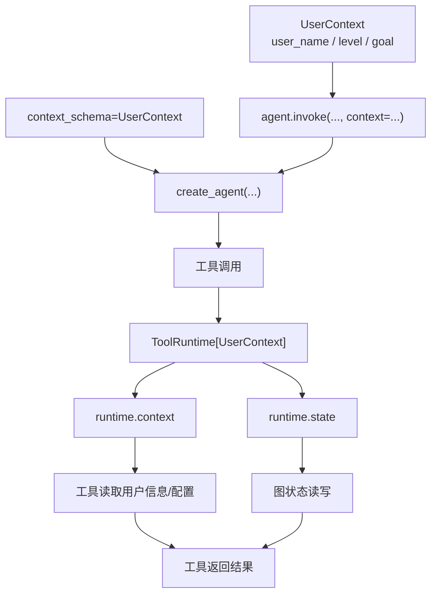

# LC-07：Runtime

## 本阶段目标

这一阶段学习 agent 运行时上下文。学完后，你应该能回答五个问题：

1. `context_schema` 是什么，为什么它适合放用户 ID、会话配置、依赖对象这类“本次调用固定信息”？
2. `agent.invoke(..., context=...)` 传入的 `context` 和 `messages`、`thread_id` 有什么区别？
3. 工具函数里的 `runtime: ToolRuntime[...]` 是怎么被自动注入的？
4. `runtime.context`、`runtime.state`、`runtime.store`、`runtime.config`、`runtime.tool_call_id` 分别大概代表什么？
5. 为什么运行期上下文比全局变量更适合生产代码和测试？

## 官方资料核对

已核对官方文档和本地锁定依赖：

- LangChain Runtime：<https://docs.langchain.com/oss/python/langchain/runtime>
- LangChain Tools：<https://docs.langchain.com/oss/python/langchain/tools>
- 本项目当前锁定：`langchain==1.3.9`、`langgraph==1.2.5`

关键结论：

- LangChain v1 的 `create_agent(...)` 底层运行在 LangGraph runtime 之上。
- 创建 agent 时可以传 `context_schema=...`，用于声明本次运行上下文的数据结构。
- 调用 agent 时通过 `agent.invoke(..., context=Context(...))` 传入本轮上下文。
- 工具函数中添加 `runtime: ToolRuntime[Context]` 参数后，LangChain / LangGraph 会自动注入运行期对象；这个参数不会暴露给模型填写。
- 官方文档中推荐从 `langchain.tools` 导入 `tool` 和 `ToolRuntime`；本地源码也确认 `langchain.tools.ToolRuntime` re-export 自 `langgraph.prebuilt.ToolRuntime`。
- 工具中的 `ToolRuntime` 和 middleware / graph node 中的 `Runtime` 相关但不完全一样；`ToolRuntime` 多了工具专属信息，例如 `state`、`config`、`tool_call_id`、`tools`。

## Runtime 解决什么问题

前面阶段已经写过 tools。普通工具只接收模型传进来的参数：

```python
@tool
def search_notes(query: str) -> str:
    ...
```

这适合“模型知道要查什么”的场景。但真实应用里，工具经常还需要一些不应该让模型决定的信息：

- 当前用户是谁：`user_id`
- 当前学习阶段：`study_stage`
- 当前租户、地区、权限、偏好
- 数据库连接、缓存、长程记忆 store
- 当前运行的 thread / run 信息

这些信息如果放在全局变量里，测试和多用户并发都会变得脆弱；如果让模型作为工具参数传入，又不安全，也不稳定。Runtime context 的作用就是把这些“运行时依赖”从 agent 调用侧注入进去。

## 三层上下文

学习 Runtime 时，容易把几个“上下文”混在一起：

| 名称 | 传入位置 | 主要用途 | 是否适合模型填写 |
| --- | --- | --- | --- |
| `messages` | `agent.invoke({"messages": [...]})` | 对话内容，模型要阅读和续写的上下文 | 是 |
| `context` | `agent.invoke(..., context=...)` | 本次调用固定依赖，如用户、权限、配置 | 否 |
| `thread_id` | `config={"configurable": {"thread_id": ...}}` | 标识一个对话线程，配合 memory / checkpointer 使用 | 否 |

可以先这样记：

- `messages` 是“模型看到的对话”。
- `context` 是“程序注入给工具和中间件的运行资料”。
- `thread_id` 是“这段对话属于哪个线程”。

LC-07 只练 `context` 和工具中的 `ToolRuntime`。`thread_id` 会在 LC-10 Short-term Memory 里系统学习。

## `context_schema`

官方示例使用 `dataclass` 定义 context：

```python
from dataclasses import dataclass


@dataclass
class UserContext:
    user_id: str
    user_name: str
    study_stage: str
```

然后创建 agent 时声明：

```python
agent = create_agent(
    model=model,
    tools=[...],
    context_schema=UserContext,
)
```

这样工具里就可以获得带类型提示的 `runtime.context`：

```python
@tool
def get_profile(runtime: ToolRuntime[UserContext]) -> str:
    """Get current user's profile."""
    return runtime.context.user_id
```

这里的 `ToolRuntime[UserContext]` 是 Python 类型标注的泛型写法。它告诉编辑器和读代码的人：`runtime.context` 预期是 `UserContext` 类型，所以可以访问 `.user_id`、`.user_name` 这些属性。

## `ToolRuntime`

工具函数只要声明一个 `runtime: ToolRuntime` 参数，LangChain 就会自动注入它。这个参数是保留参数，不应该当成普通工具参数让模型传。

常用字段：

| 字段 | 含义 | 本阶段是否重点 |
| --- | --- | --- |
| `runtime.context` | 本次 invoke 传入的运行上下文 | 重点 |
| `runtime.state` | 当前图状态，agent 中通常能看到 `messages` | 简单观察 |
| `runtime.store` | 长程记忆存储对象 | 后续 LC-11 深入 |
| `runtime.stream_writer` | 自定义流式输出写入器 | 后续 streaming 场景再看 |
| `runtime.config` | 当前运行配置，例如 callbacks、tags、metadata 等 | 简单知道 |
| `runtime.tool_call_id` | 当前工具调用 ID | 简单观察 |
| `runtime.execution_info` | 当前执行身份与重试信息 | 进阶观察 |
| `runtime.server_info` | LangGraph Server 环境中的服务端信息 | 本地通常为 `None` |

最小学习重点是：工具既可以接收模型传来的业务参数，也可以读取程序注入的运行期信息。

```python
@tool
def recommend_next_step(topic: str, runtime: ToolRuntime[UserContext]) -> str:
    """Recommend the next learning step for a topic."""
    stage = runtime.context.study_stage
    return f"{runtime.context.user_name} 当前在 {stage}，建议继续复习 {topic}。"
```

其中 `topic` 由模型决定，`runtime` 由框架注入。

## 可选参数

LC-07 也会顺手遇到 Python 的可选参数。比如：

```python
@dataclass
class UserContext:
    user_id: str
    user_name: str
    study_stage: str
    preferred_language: str = "zh"
```

`preferred_language` 有默认值，所以创建对象时可以不传：

```python
UserContext(user_id="u001", user_name="小明", study_stage="LC-07")
```

如果字段真的可能为空，可以写成：

```python
nickname: str | None = None
```

这里的 `str | None` 表示值可以是字符串，也可以是 `None`；后面的 `= None` 表示不传时默认就是 `None`。这和 LC-06 里 Pydantic 的“可为空”和“可省略”概念类似，但这里是普通 Python dataclass，不负责复杂校验。

## 图解

### Runtime context 注入链路



读图重点：

- `context_schema` 描述运行期上下文的结构。
- `agent.invoke(..., context=...)` 提供本次调用的上下文值。
- 工具通过 `ToolRuntime` 读取 `runtime.context`，必要时也可以接触 `runtime.state`。

## 本阶段手写实践任务

请你亲手完成 `learning/LC_07_runtime/runtime_context_skeleton.py`：

1. 补全 `get_learning_profile(...)`：
   - 从 `runtime.context` 读取 `user_id`、`user_name`、`study_stage`。
   - 根据 `user_id` 查询本地 `LEARNING_PROFILES`。
   - 返回一段简洁中文说明。
2. 补全 `get_recent_user_message(...)`：
   - 从 `runtime.state["messages"]` 读取消息列表。
   - 找到最后一条用户消息。
   - 返回消息内容；找不到时返回可读提示。
3. 补全 `build_runtime_agent()`：
   - 使用 `build_chat_model()` 创建模型。
   - 使用 `create_agent(...)`，传入工具列表和 `context_schema=UserContext`。
4. 补全 `invoke_runtime_agent(...)`：
   - 创建 `UserContext(...)`。
   - 调用 `agent.invoke({"messages": [...]}, context=context)`。
5. 手动运行脚本，观察工具返回中是否使用了 `context` 里的用户信息。

建议你先只实现 `get_learning_profile(...)`，确认 runtime 注入成功后，再实现 `runtime.state` 的观察函数。这样排错范围更小。

## 观察重点

运行时重点观察：

- 工具 schema 里不会要求模型提供 `runtime` 参数。
- `runtime.context.user_id` 的值来自你调用 `agent.invoke(..., context=...)` 时传入的对象。
- 如果用户问题里胡说另一个 user id，工具仍然应该以 `runtime.context.user_id` 为准。
- `runtime.state["messages"]` 通常能看到当前 agent 状态里的消息历史，但不要在本阶段把它当成长期记忆。

## 常见坑

- 忘记在 `create_agent(...)` 中写 `context_schema=UserContext`。
- 调用 agent 时忘记传 `context=UserContext(...)`。
- 把 `agent.invoke(...)` 的第一个参数写成纯字符串，例如 `agent.invoke(question, context=context)`。`create_agent(...)` 返回的是 LangGraph 应用，入口状态应是 dict，例如 `{"messages": [{"role": "user", "content": question}]}`。
- 把 `runtime` 当成普通工具参数，试图让模型生成它。
- 工具参数名写成 `runtime`，但类型标注不是 `ToolRuntime`。
- 在工具里读全局变量保存当前用户，导致多用户或测试时串数据。
- 把 `context` 当成对话记忆；它是本次 invoke 的静态运行资料，不会自动保存历史。

## 实践复盘

本阶段完成了 `learning/LC_07_runtime/runtime_context_skeleton.py` 的手写实践：

- 使用 `@dataclass` 定义 `UserContext`，包含 `user_id`、`user_name`、`study_stage` 和带默认值的 `preferred_language`。
- 在 `create_agent(...)` 中传入 `context_schema=UserContext`，让 agent 知道运行期上下文结构。
- 在 `agent.invoke(...)` 中通过 `context=context` 注入本次调用的用户上下文。
- 在 `get_learning_profile(...)` 中通过 `runtime.context.user_id` 查找 `LEARNING_PROFILES`，验证工具可以读取程序注入的用户信息。
- 在 `get_recent_user_message(...)` 中通过 `runtime.state.get("messages", [])` 观察当前 agent 状态中的消息列表，并从后往前找到最近一条 `HumanMessage`。

`LEARNING_PROFILES` 是本阶段为了学习 runtime context 临时放在代码里的本地字典，用来模拟“用户学习画像”。真实项目中，这类数据通常不会硬编码在工具文件里，而是来自数据库、缓存、用户系统，或者后续 LC-11 会学习的 long-term memory / store。

### 排错记录：`InvalidUpdateError`

实践中遇到过这个错误：

```text
langgraph.errors.InvalidUpdateError: Expected dict, got 请先查看我的学习画像...
```

原因是调用写成了：

```python
agent.invoke(question, context=context)
```

这里把纯字符串 `question` 作为 agent 的入口输入。LangChain v1 的 `create_agent(...)` 底层是 LangGraph 应用，入口需要的是图状态 dict，而不是普通字符串。

修正写法：

```python
agent.invoke(
    {"messages": [{"role": "user", "content": question}]},
    context=context,
)
```

这个问题很适合帮助区分两类输入：

- `{"messages": ...}` 是传给 agent 图状态和模型对话的输入。
- `context=context` 是传给 runtime、tools、middleware 的运行期依赖。

### 代码检查

阶段收尾时执行了：

```powershell
.venv\Scripts\ruff.exe check learning\LC_07_runtime\runtime_context_skeleton.py
```

检查通过。实践代码中保留了少量 `print(...)`，用于观察 `runtime.state["messages"]` 和最近一条 `HumanMessage`。这适合学习阶段；如果未来把它整理成可复用示例，可以改成更干净的 `inspect_result(...)` 输出或日志。

## 阶段总结

LC-07 的关键不是“再多写一个工具”，而是理解工具参数有两类来源：

- **模型决定**的业务参数，例如 `query`、`topic`、`expression`。
- **框架注入**的运行期参数，例如 `runtime: ToolRuntime[UserContext]`。

这让工具可以既被模型调用，又能安全地访问当前用户、运行配置、状态和后续 memory/store 等程序侧信息。生产代码里，用户身份、权限、租户、数据库连接等信息应优先通过 runtime context 或其他受控依赖注入方式传入，**而不是让模型自由生成。**

## 和后续阶段的关系

- LC-08 Middleware：middleware 也能读取 runtime，用来做动态 prompt、日志、人工确认等控制逻辑。
- LC-10 Short-term Memory：`thread_id`、checkpointer、线程内消息历史会正式登场。
- LC-11 Long-term Memory：`runtime.store` 会用于跨会话保存偏好和资料。
- LC-15 MCP：外部工具和客户端生命周期会让 runtime / context 的价值更明显。
