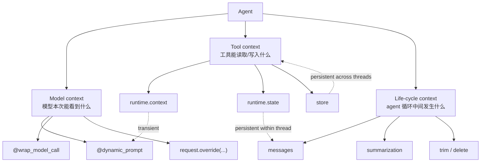

# LC-09：上下文工程

## 本阶段目标

这一阶段学习 LangChain agent 的 context engineering（上下文工程）。学完后，你应该能回答这些问题：

1. 为什么上下文工程不只是写 system prompt（系统提示词）？
2. model context（模型上下文）、tool context（工具上下文）、life-cycle context（生命周期上下文）分别控制什么？
3. `runtime.context`、`state`、`store` 三类数据源有什么边界？
4. `dynamic_prompt` 和 `wrap_model_call` 分别适合做什么？
5. 为什么工具名称、工具描述、参数 schema（结构描述）本身也是上下文？
6. transient（短暂的）更新和 persistent（持久的）更新有什么区别？
7. 如何通过按需加载资料、筛选工具、摘要历史来控制成本和行为？

## 官方资料核对

已核对 LangChain v1 官方文档：

- Context engineering in agents：<https://docs.langchain.com/oss/python/langchain/context-engineering>
- Context overview：<https://docs.langchain.com/oss/python/concepts/context>
- Middleware overview：<https://docs.langchain.com/oss/python/langchain/middleware/overview>
- Tools：<https://docs.langchain.com/oss/python/langchain/tools>
- 本项目当前锁定：`langchain==1.3.9`、`langgraph==1.2.5`

官方文档把 context engineering 放在 agent 的高级用法中。它不是单独的新运行时，而是围绕 agent loop（agent 循环）管理“模型这次调用能看到什么、工具能读写什么、每轮之间如何压缩或保存上下文”的工程方法。

## 为什么需要上下文工程

LangChain 官方文档指出，agent 不可靠通常有两类原因：

- 模型本身能力不够。
- 没有把正确的上下文传给模型。

LC-09 关注第二类问题。上下文工程的目标不是把所有资料都塞进 prompt，而是在合适时机给 agent 合适的信息、工具和输出约束。

一个简化的 agent loop：

```text
用户消息 -> 模型调用 -> 工具执行 -> 模型再次调用 -> 最终回答
```

在这个循环里，每次模型调用都像一次“开卷考试”。如果给错资料、给太多资料、给错工具，模型就可能：

- 不调用该调用的工具。
- 调用不该调用的工具。
- 被过长历史干扰，忘记当前问题。
- 输出格式不稳定。
- 成本和延迟变高。

所以，上下文工程不是“提示词写得漂亮”，而是系统性控制：

- 给模型什么指令。
- 给模型哪些消息。
- 给模型哪些工具。
- 选择哪个模型。
- 要求模型用什么格式输出。
- 工具执行时能读写哪些上下文。
- 什么时候压缩、过滤、注入或持久化上下文。

## 官方视角里的三类上下文

LangChain 官方文档把 agent 里的可控上下文分成三类：

| 类型 | 控制内容 | 常见机制 | 典型生命周期 |
| --- | --- | --- | --- |
| Model context（模型上下文） | 模型调用时看到的 instructions（指令）、messages（消息历史）、tools（工具）、model（模型）、response format（响应格式） | `dynamic_prompt`、`wrap_model_call`、`request.override(...)` | 通常是 transient |
| Tool context（工具上下文） | 工具执行时能读取和写入的数据 | `ToolRuntime`、`runtime.context`、`runtime.state`、`runtime.store`、`Command` | 可能是 transient，也可能 persistent |
| Life-cycle context（生命周期上下文） | 模型调用和工具执行之间发生的控制逻辑 | middleware、summarization（摘要）、guardrails（防护规则）、logging（日志） | 通常影响 state/store |

这三类上下文不是三个独立模块，而是三个观察角度：

- Model context 关注“模型看见什么”。
- Tool context 关注“工具知道什么、产出什么、保存什么”。
- Life-cycle context 关注“agent loop 中间发生什么控制动作”。

## Context 的两个维度

官方概念文档还从两个维度理解 context（上下文）：

| 维度 | 类型 | 含义 | 例子 |
| --- | --- | --- | --- |
| mutability（可变性） | static context（静态上下文） | 执行过程中不改变 | 用户 ID、权限、数据库连接、API client |
| mutability（可变性） | dynamic context（动态上下文） | 执行过程中会变化 | 消息历史、中间结果、工具观察结果 |
| lifetime（生命周期） | runtime context（运行期上下文） | 单次运行或一次会话内有效 | 本次调用传入的用户信息、环境配置 |
| lifetime（生命周期） | cross-conversation context（跨会话上下文） | 多次对话之间持久存在 | 用户偏好、长期画像、历史记忆 |

注意：`runtime context` 不是 LLM context window（模型上下文窗口）。  

- `runtime.context` 是你的代码运行时需要的静态配置或依赖。
- context window 是模型一次调用最多能接收的 token（词元）数量。
- 上下文工程要做的是用 `runtime.context`、`state`、`store` 等数据源，组织出更合适的 model context。

## 三类数据源

### Runtime Context

`runtime.context` 是一次调用内的静态配置。它通过 `context_schema` 声明，再通过 `agent.invoke(..., context=...)` 传入。

适合放：

- `user_id`
- 当前学习阶段
- 用户权限
- provider 配置
- API key、数据库连接等外部依赖
- 是否允许高级工具

它的关键特点：

- 由你的代码提供，不让模型自己编造。
- 通常不在 agent 执行过程中修改。
- 可以被 dynamic prompt、middleware、tool 读取。

LC-07 已经练过：

```python
agent.invoke(
    {"messages": [{"role": "user", "content": question}]},
    context=UserContext(...),
)
```

在 LC-09 中，`StudyContext` 继续承担这个角色：

```python
@dataclass
class StudyContext:
    user_id: str
    current_stage: str
    response_style: str = "concise"
    allow_advanced_tools: bool = False
```

这里的 `allow_advanced_tools` 很适合控制“模型本次能看到哪些工具”。

### State

`state` 是线程内短期状态，最典型的是 `messages`。

适合放：

- 当前消息历史。
- 本轮工具调用结果。
- 会话内认证状态。
- 上传文件摘要。
- 只对当前线程有意义的中间状态。

在 `ModelRequest` 里：

```python
request.messages
```

可以理解为：

```python
request.state["messages"]
```

如果你用 `request.override(messages=...)` 临时修改消息列表，默认只是影响这一次模型调用，不一定写回 state。这就是 transient update（短暂更新）。

### Store

`store` 是跨会话长期记忆。它适合放：

- 用户偏好。
- 历史学习画像。
- 长期保存的事实。
- 跨线程共享的配置或 feature flags（功能开关）。

LC-09 只先理解它的位置，不深入实现；LC-11 会专门学习 long-term memory（长期记忆）。

## Model Context：本阶段只关注动态控制

model、messages、tools、structured output 这些基础内容前面已经学过：

- LC-03：模型配置。
- LC-04：消息结构。
- LC-05：工具调用。
- LC-06：结构化输出。

LC-09 不重复讲这些 API，只换一个观察角度：**模型每次调用前，哪些内容可以按当前上下文动态调整**。

本阶段重点放在两个动作上：

| 动作 | 解决的问题 | 骨架位置 |
| --- | --- | --- |
| `dynamic_prompt` | 根据运行期上下文生成本次 system prompt（系统提示词） | `build_study_prompt` |
| `request.override(...)` | 在本次模型调用前临时替换 messages、tools 等请求内容 | `configure_model_context` |

### 动态 Prompt

静态 prompt 对所有请求都一样；动态 prompt 可以读取 `request.runtime.context`，根据当前阶段、回答风格、消息数量等生成更合适的指令。

LC-09 里只需要把握一个原则：prompt 要短而明确，不要把 `STUDY_MATERIALS` 全量拼进去。真正需要学习资料时，让模型调用 `load_study_material` 按需加载。

### 临时覆盖请求

`request.override(...)` 适合做 transient（短暂的）调整，例如本次只暴露一部分工具：

```python
request = request.override(tools=filtered_tools)
return handler(request)
```

这个动作改变的是“模型本次能看到什么”，不是永久修改 agent 的工具定义，也不是写入长期记忆。

## Tool Context：工具能读什么、写什么

工具不仅是“被模型调用的函数”，也是 agent 获取和更新上下文的重要入口。

### 工具读取上下文

工具可以读取三类数据：

| 来源 | 读取方式 | 适合用途 |
| --- | --- | --- |
| Runtime Context | `runtime.context` | 用户 ID、权限、当前阶段、外部连接 |
| State | `runtime.state` | 当前消息历史、认证状态、本轮中间结果 |
| Store | `runtime.store` | 用户偏好、长期记忆、跨会话资料 |

LC-09 骨架里的 `load_study_material` 就是一个读取 runtime context 的例子：

```python
@tool
def load_study_material(topic: str, runtime: ToolRuntime[StudyContext]) -> str:
    current_stage = runtime.context.current_stage
    ...
```

这个工具的设计重点是：资料按需加载，而不是一开始全部放进 system prompt。

### 工具写入上下文

工具也可以写入上下文：

- 写入 state：更新当前会话内状态。
- 写入 store：保存跨会话长期信息。

官方示例里，工具可以通过 `Command(update=...)` 写入 state，也可以通过 `runtime.store.put(...)` 写入 store。

LC-09 不要求你手写写入逻辑，因为：

- state 写入会在 LC-10 short-term memory（短期记忆）继续学。
- store 写入会在 LC-11 long-term memory（长期记忆）继续学。

但你现在要先记住边界：工具返回字符串只是把结果交给模型；工具写 state/store 才会影响后续上下文。

## Life-Cycle Context：agent 循环中间发生什么

life-cycle context 控制模型调用和工具执行之间的流程。它通常依赖 middleware（中间件）。

它适合做：

- logging（日志）。
- guardrails（防护规则）。
- summarization（摘要）。
- 人工确认。
- 跳过某些工具执行。
- 修改下一次模型调用的上下文。
- 在特定条件下重复模型调用。

LC-08 已经学过 middleware hooks。LC-09 要把 middleware 放到上下文工程视角里理解：

- `dynamic_prompt`：动态生成 system prompt。
- `wrap_model_call`：包住模型调用，临时修改 messages、tools、model、response format。
- `wrap_tool_call`：包住工具调用，清洗工具结果、记录审计、处理异常。
- `before_model` / `after_model`：在模型调用前后观察或更新 state。

### Summarization

summarization（摘要）是典型的 life-cycle context。

当对话变长时，直接把全部历史塞给模型会带来：

- token 成本增加。
- 延迟增加。
- 超出 context window。
- 当前问题被旧信息干扰。

`SummarizationMiddleware` 的思路是：用一次额外模型调用把较旧消息压缩成摘要，再保留最近若干消息。

它和 transient message trimming（临时裁剪消息）不同：

- 临时裁剪：只影响本次模型调用。
- 摘要 middleware：会把历史替换成摘要并写回 state，后续轮次继续看到摘要。

所以 summarization 是 persistent（持久）的上下文更新。

## Transient 与 Persistent

这是 LC-09 最容易混淆的点。

| 类型 | 含义 | 例子 | 后续轮次是否继承 |
| --- | --- | --- | --- |
| Transient（短暂的） | 只影响当前模型调用 | `request.override(messages=...)`、`request.override(tools=...)` | 通常不继承 |
| Persistent（持久的） | 写入 state 或 store | `Command(update=...)`、`runtime.store.put(...)`、摘要写回 state | 会继承 |

判断方法：

1. 只是改了 `ModelRequest`：多半是 transient。
2. 写入了 `state`：当前线程后续可见。
3. 写入了 `store`：跨会话后续可见。
4. 使用 summary 替换历史消息：属于 persistent，因为后续消息历史已经变了。

## 图解

### 三类上下文与生命周期



读图重点：

- model context 关注“模型看到什么”。
- tool context 关注“工具能读写什么”。
- lifecycle context 关注“agent 执行过程中如何管理消息、摘要和状态”。
- transient / persistent 的区别会直接影响上下文是否跨调用保留。

## 成本控制：为什么不要把所有资料塞进 prompt

上下文越多，不代表回答越好。常见问题：

- 成本更高：更多 token 意味着更多费用。
- 延迟更高：模型处理更慢。
- 注意力稀释：模型可能抓不住当前问题重点。
- 干扰增加：旧信息或无关信息可能误导模型。
- 工具选择更难：工具太多时模型更容易选错。

LC-09 的实践设计故意很小：

- `STUDY_MATERIALS` 只模拟一个小资料库。
- `load_study_material` 按 topic 返回少量内容。
- `estimate_context_size` 只是粗略估算，不追求精确 token 统计。
- `configure_model_context` 通过 `allow_advanced_tools` 控制高级工具可见性。

这其实是在为后续 RAG 做准备：RAG 的核心也不是“把文档全塞给模型”，而是“先检索，再把少量相关内容放进模型上下文”。

## 本阶段骨架对应关系

文件：

- `learning/LC_09_context_engineering/context_engineering_skeleton.py`
- `learning/LC_09_context_engineering/context_engineering_skeleton.origin.py`

骨架中的函数和知识点对应关系：

| 函数或对象 | 练习点 |
| --- | --- |
| `StudyContext` | 定义 runtime context，控制当前阶段、回答风格、工具权限 |
| `load_study_material` | 工具按需读取资料，避免 prompt 过长 |
| `estimate_context_size` | 观察上下文成本，理解 token 只是粗略估算 |
| `read_latest_user_message` | 通过 `runtime.state` 读取当前消息历史 |
| `build_study_prompt` | 用 `dynamic_prompt` 根据上下文生成 system prompt |
| `configure_model_context` | 用 `wrap_model_call` 和 `request.override(...)` 动态筛选本次模型可见工具 |
| `build_and_invoke_context_engineering_agent` | 将 `create_agent`、`invoke` 和结果观察适度放在一起，并用代码块注释区分流程 |

建议手写顺序：

1. 先补全 `load_study_material`，让它能根据阶段编号或关键词返回少量资料。
2. 再补全 `estimate_context_size`，返回字符数和粗略 token 估算。
3. 再补全 `read_latest_user_message`，观察工具读取 `runtime.state`。
4. 再补全 `build_study_prompt`，用 `runtime.context` 生成短 system prompt。
5. 然后补全 `configure_model_context`，观察不同 context 下可用工具变化。
6. 最后补全 `build_and_invoke_context_engineering_agent`，按 `create_agent`、`invoke`、结果观察三个代码块组织实践流程。

## 实践观察重点

实践时建议重点观察这些现象：

1. 不把 `STUDY_MATERIALS` 全量写进 system prompt 时，模型是否会主动调用 `load_study_material`？
2. `allow_advanced_tools=False` 时，模型是否看不到 `estimate_context_size`？
3. `allow_advanced_tools=True` 时，模型是否可能主动估算上下文成本？
4. `response_style="concise"` 是否能让动态 prompt 改变回答风格？
5. 当问题一次问多个阶段时，`load_study_material` 的设计是否支持多次调用？
6. `inspect_result(result)` 中能否看到 AIMessage、ToolMessage 的顺序？

## 实践复盘

本阶段实践中，学习者完成了一个轻量上下文工程 agent，用于观察 dynamic prompt、tool context 和 model request override 的行为。

### 已覆盖的关键 API

- `@dynamic_prompt`：注册动态 system prompt 生成逻辑。
- `@wrap_model_call`：包住模型调用，修改本次模型请求。
- `ModelRequest` / `ModelResponse`：理解模型调用前后的请求与响应对象。
- `request.runtime.context`：在 middleware 中读取 `StudyContext`。
- `request.system_message`：观察动态 prompt 是否已经写入本次模型请求。
- `request.tools`：读取当前模型可见工具。
- `request.override(tools=...)`：临时替换本次模型调用可见工具。
- `ToolRuntime[StudyContext]`：在工具中读取运行期上下文和 agent state。
- `runtime.context`：工具中读取 `max_materials`、`allow_advanced_tools` 等配置。
- `runtime.state.get("messages", [])`：工具中读取当前消息历史。
- `create_agent(..., middleware=[...], context_schema=StudyContext)`：组合模型、工具、中间件和上下文 schema。
- `agent.invoke(..., context=context)`：调用 agent 时传入运行期上下文。

### 关键观察结论

1. `@dynamic_prompt` 是一种专门生成 system prompt 的 middleware。它底层会把函数返回值写入 `request.system_message`，不会直接出现在 `result["messages"]` 中。
2. 想验证 dynamic prompt 是否生效，可以在 `build_study_prompt` 里打印，或者在后续 `wrap_model_call` 中打印 `request.system_message`。
3. `configure_model_context` 中通过 `request.override(tools=filtered_tools)` 筛选工具，只影响当前模型调用，属于 transient（短暂的）上下文调整。
4. `allow_advanced_tools=False` 时，可以只保留 `load_study_material`、`read_latest_user_message` 等基础工具；设置为 `True` 后，再暴露 `estimate_context_size`。
5. `load_study_material(topic: str, ...)` 的参数只接收一个查询条件，因此当用户同时问 LC-07、LC-08、LC-09 时，模型可能多次调用工具，而不是一次工具调用返回所有资料。
6. `max_materials` 限制的是“单次工具调用最多返回多少条资料”，不是整个 agent 本轮最多调用几次工具。
7. 如果要一次工具调用处理多个条件，可以额外设计 `topics: list[str]` 形式的工具；这属于工具 schema 设计问题。
8. `runtime.context` 不会自动进入模型上下文，只有通过 dynamic prompt、工具结果或消息注入放进去，模型才看得到。
9. `runtime.state` 可以让工具观察当前消息历史，但写入 state/store 会进入后续 memory 阶段继续学习。

### 代码检查记录

本阶段代码已通过 `py_compile` 语法检查。实践任务覆盖了本阶段主要练习点：dynamic prompt、tool context、`request.override(...)`、工具可见性控制、运行期上下文传入和结果消息观察。

有两处可手动优化：

```python
return f"\n{lines}"
```

建议改为：

```python
return "\n".join(lines)
```

否则工具返回会是 Python 列表字符串，不如逐行文本清晰。

```python
return f"\n{prompt_parts}"
```

建议改为：

```python
return "\n".join(prompt_parts)
```

否则 system prompt 中也会出现列表样式。虽然不一定导致运行失败，但不利于模型稳定理解指令。

## 常见坑

### 1. 把 runtime context 和 model context 混为一谈

`runtime.context` 不会自动进入模型 prompt。它只是你的代码、middleware 和工具可以读取的运行期数据。

如果模型需要知道其中某些信息，你要通过 dynamic prompt、message injection（消息注入）或工具结果把它放进 model context。

### 2. 工具返回太多内容

`load_study_material` 不应该一次返回所有阶段资料。否则虽然看起来“资料完整”，但违背了按需加载的练习目标。

更好的做法：

- 命中一个阶段就返回一个阶段。
- 多阶段问题允许模型多次调用工具。
- 没命中时提示可查询哪些阶段。

### 3. 工具描述太模糊

工具 docstring 会进入模型上下文。如果描述太模糊，模型不知道什么时候该调用它。

例如：

```python
"""Load a small piece of study material by stage ID or keyword."""
```

这比：

```python
"""Load data."""
```

更有利于模型正确选择工具。

### 4. 误以为 `request.override(...)` 会永久修改状态

`request.override(...)` 修改的是当前模型请求。它适合临时筛选工具、临时注入消息、临时切换模型。

如果你希望后续轮次也继承某个结果，需要写入 state 或 store。

### 5. 粗略 token 估算不等于真实 tokenizer

`estimate_context_size` 里用字符数估算 token，只是学习阶段的直觉工具。真实 token 数取决于模型 tokenizer（分词器），中英文、标点、空格、代码都会影响结果。

## 阶段小结

LC-09 的核心不是多背几个 API，而是建立一个判断框架：

1. 模型这次需要知道什么？
2. 这些信息来自 runtime context、state 还是 store？
3. 这些信息应该直接进 prompt，还是通过工具按需加载？
4. 这次修改是 transient，还是要写回 state/store 成为 persistent？
5. 工具、模型、输出格式是否也应该按当前上下文动态选择？

能回答这几个问题，就已经进入了上下文工程的核心。
