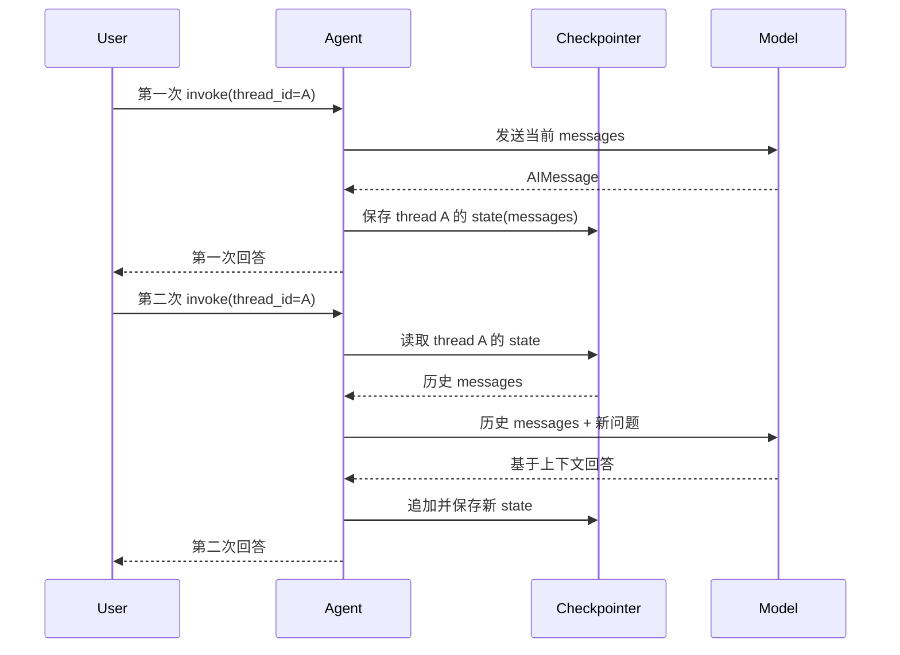

# LC-10：Short-term Memory

## 1. 本阶段目标

本阶段学习 LangChain v1 agent 的短期记忆（short-term memory）。

最小目标：

- 理解 short-term memory 是线程内（thread-scoped）的会话状态，不是跨用户、跨会话的长期偏好库。
- 会用 `checkpointer=InMemorySaver()` 给 agent 开启线程级持久化。
- 会用 `config={"configurable": {"thread_id": "..."}}` 区分不同对话线程。
- 会观察同一个 `thread_id` 下多轮对话如何复用历史消息，不同 `thread_id` 如何隔离。
- 初步理解 Python `with` 和资源管理在生产级 checkpointer 中的作用。

## 2. 官方文档核对

本阶段优先核对 LangChain / LangGraph 官方文档：

- LangChain Short-term memory：`https://docs.langchain.com/oss/python/langchain/short-term-memory`
- LangGraph Checkpointers：`https://docs.langchain.com/oss/python/langgraph/checkpointers`

关键结论：

- LangChain agent 的短期记忆通过 agent state 管理，默认核心字段是 `messages`。
- 要开启线程级短期记忆，需要在 `create_agent(...)` 时传入 `checkpointer`。
- `thread_id` 是 checkpointer 保存和恢复状态的主键；同一个 `thread_id` 会继续同一段对话状态，不同 `thread_id` 相互隔离。
- `InMemorySaver` 适合本地学习和进程内 demo；生产环境通常使用数据库型 checkpointer，例如 Postgres / SQLite 等。
- 短期记忆会随着会话变长而增加上下文成本，后续需要配合 trim、delete 或 summarization 等策略控制消息历史。

## 3. 核心概念

### 3.1 Memory

Memory 是让应用记住过去交互的机制。对 agent 来说，最常见的短期记忆就是 conversation history，也就是之前的 human / assistant / tool messages。

短期记忆关注的是“同一条对话线里发生过什么”。如果需要跨线程、跨会话记住用户偏好、长期事实或应用级资料，那属于 LC-11 Long-term Memory。

### 3.2 Thread

Thread 可以理解为一段独立会话的 ID。它不是 Python 线程，而是 LangGraph checkpoint 体系里的对话线标识。

示例：

```python
config = {"configurable": {"thread_id": "lc-10-demo"}}
```

同一个 agent、同一个 checkpointer、同一个 `thread_id`，再次 `invoke(...)` 时就能读取之前保存的 messages。

### 3.3 Checkpointer

Checkpointer 负责把 graph state 保存成 checkpoint。对 agent 来说，它让多轮调用之间能恢复同一条 thread 的 state。

学习阶段常用：

```python
from langgraph.checkpoint.memory import InMemorySaver

checkpointer = InMemorySaver()
agent = create_agent(
    model=model,
    tools=[],
    checkpointer=checkpointer,
)
```

注意：`InMemorySaver` 只保存在当前 Python 进程内。程序退出后，内存里的 checkpoint 会消失。

### 3.4 State 与 Messages

LangChain agent 默认使用 `AgentState` 管理短期记忆。短期记忆最核心的字段是：

```python
state["messages"]
```

每次 agent 调用结束后，checkpointer 会保存当前 thread 的 state。下一次用同一个 `thread_id` 调用时，之前的 messages 会重新进入 agent 的状态。

## 4. 图解

### Short-term memory 状态恢复流程



读图重点：

- `thread_id` 是恢复哪段短期记忆的主键。
- checkpointer 保存的是 agent state，最核心字段是 `messages`。
- 同一个 thread 会继续追加历史，不同 thread 默认隔离。

## 5. 调用流程

最小流程：

1. 创建 checkpointer。
2. 创建 agent，并传入 `checkpointer=checkpointer`。
3. 第一次调用时传入 `thread_id`，告诉 agent 用户名字或某个事实。
4. 第二次用同一个 `thread_id` 提问，观察 agent 是否能记住上一轮信息。
5. 换一个新的 `thread_id` 提问，观察 agent 是否无法读取另一个线程里的历史。

伪代码：

```python
agent = create_agent(..., checkpointer=InMemorySaver())

config_a = {"configurable": {"thread_id": "thread-a"}}
config_b = {"configurable": {"thread_id": "thread-b"}}

agent.invoke({"messages": [{"role": "user", "content": "我叫小林"}]}, config_a)
agent.invoke({"messages": [{"role": "user", "content": "我叫什么？"}]}, config_a)

agent.invoke({"messages": [{"role": "user", "content": "我叫什么？"}]}, config_b)
```

预期观察：

- `thread-a` 中第二次提问，模型应能根据历史回答“小林”。
- `thread-b` 没有前一轮历史，模型不应该知道名字。

## 6. Python 要点：with 与资源管理

`with` 用来管理需要“进入 / 退出”的资源，例如文件、数据库连接、网络连接、checkpointer 连接等。

典型结构：

```python
with resource_factory() as resource:
    use(resource)
```

执行含义：

- 进入 `with` 时创建或打开资源。
- `with` 块内使用资源。
- 无论中间是否抛异常，退出 `with` 时都会清理资源。

官方生产示例中，Postgres checkpointer 会使用类似结构：

```python
with PostgresSaver.from_conn_string(DB_URI) as checkpointer:
    checkpointer.setup()
    agent = create_agent(..., checkpointer=checkpointer)
```

本阶段暂不要求安装数据库依赖；先理解 `with` 解决的是资源生命周期问题。

## 7. 手写实践任务

对应骨架：`short_term_memory_skeleton.py`

本阶段最终将核心流程集中在 `run_memory_demo()` 中，便于顺着一条执行链观察 short-term memory：

1. 定义 `lookup_stage_fact(...)`
   - 写一个简单工具，根据阶段编号查询本地学习事实。
   - 目标是让 agent 仍然有工具可用，观察工具消息是否也进入 thread state。

2. 在 `run_memory_demo()` 中创建 agent
   - 使用 `build_chat_model()` 创建模型。
   - 使用 `InMemorySaver()` 创建 checkpointer。
   - 调用 `create_agent(...)`，传入 `tools`、`system_prompt` 和 `checkpointer`。

3. 在 `run_memory_demo()` 中构造 thread config
   - 同一会话使用 `same_thread_config = {"configurable": {"thread_id": "lc-10-same-thread"}}`。
   - 隔离会话使用 `isolated_thread_config = {"configurable": {"thread_id": "lc-10-isolated-thread"}}`。

4. 在同一个 thread 中连续调用两轮
   - 第一轮告诉 agent 名字和当前阶段。
   - 第二轮询问名字和当前阶段。
   - 观察第二轮是否能复用第一轮保存的 messages。

5. 换一个 thread 调用
   - 不在新 thread 中提供名字。
   - 直接询问名字和阶段。
   - 观察不同 `thread_id` 之间的短期记忆不会互相泄漏。

6. 解析 result 与 state
   - 遍历 `result["messages"]`，观察 HumanMessage / AIMessage / ToolMessage。
   - 使用 `agent.get_state(config)` 读取 checkpoint 中保存的 thread state。
   - 对比两个 thread 的 `messages` 数量和内容差异。

## 8. 观察记录

本阶段实践得到的关键观察：

- 同一个 `thread_id` 下，第一次调用结束后的 messages 会被 checkpointer 保存；第二次调用会在同一条 thread state 上**继续追加**消息。
- 不同 `thread_id` 对应不同 checkpoint。`lc-10-isolated-thread` 不会自动读取 `lc-10-same-thread` 里保存的名字和对话历史。
- `agent.invoke(...)` 的返回值在本阶段通常只有顶层 `messages` key；反复打印 `result.keys()` 信息量不大，后续只有在 structured output、HITL 或自定义 state 中才更有诊断价值。
- `agent.get_state(config)` 返回的是当前 thread 的 state snapshot；本阶段主要观察 `snapshot.values["messages"]`。
- `messages` 会随着同一 thread 的多轮调用增长。短期记忆不是额外塞进 prompt 的字符串，而是由 checkpointer 恢复 agent state 后继续执行。
- 如果模型调用了 `lookup_stage_fact`，工具调用相关的 AIMessage / ToolMessage 也会进入 messages，这解释了为什么工具调用会增加上下文长度。
- `InMemorySaver` 的记忆只存在于当前 Python 进程内。重新启动程序或重新创建 checkpointer 后，之前的内存 checkpoint 不再可见。

## 9. 常见问题

### 9.1 忘记传 thread_id

使用 checkpointer 时，如果没有传入 `thread_id`，agent 无法知道要把状态保存到哪条 thread，也无法从哪条 thread 恢复。

### 9.2 每次都新建 agent 或 checkpointer

如果每次调用都重新创建 `InMemorySaver()`，之前保存在内存里的 checkpoint 就不可见了。学习 demo 中要复用同一个 agent / checkpointer 来观察多轮记忆。

### 9.3 把 short-term memory 当成 long-term memory

Short-term memory 适合同一段会话里的上下文延续。用户长期偏好、跨会话资料、可检索知识库等，不应该直接塞进短期消息历史。

## 10. 阶段小结

LC-10 完成后，需要能清楚区分三组概念：

- `messages`：模型真正会看到并持续追加的对话历史，是短期记忆最核心的内容。
- `thread_id`：保存和恢复短期记忆的会话主键，用于隔离不同对话线。
- `checkpointer`：负责把 thread state 保存成 checkpoint，并在下一次同 thread 调用时恢复。

本阶段也补上了 Python `with` 的资源管理概念：学习 demo 使用 `InMemorySaver()` 不需要显式关闭连接，但生产级数据库 checkpointer 往往需要 `with ... as checkpointer:` 管理连接生命周期。后续 LC-11 会继续区分 short-term memory 的 thread state 和 long-term memory 的跨会话 store。
