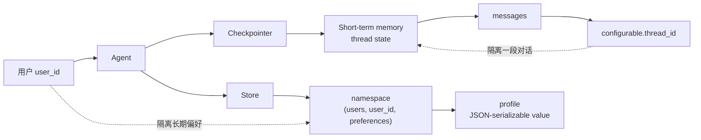
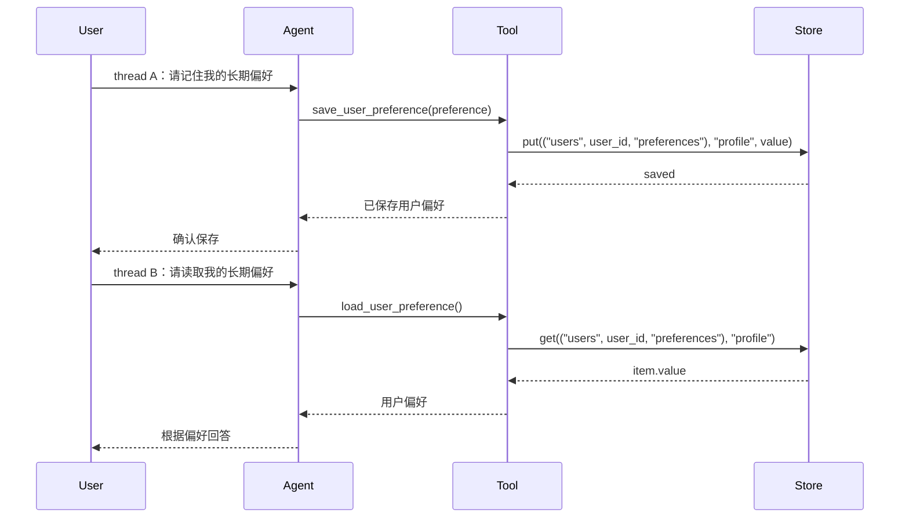
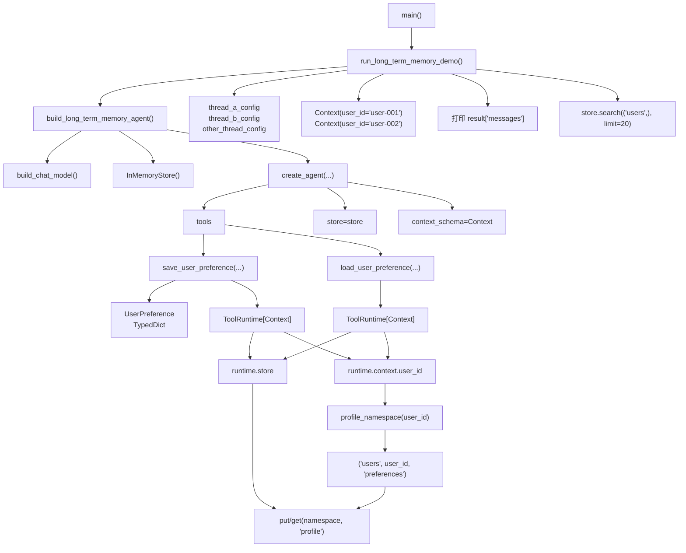

# LC-11：Long-term Memory

## 1. 本阶段目标

本阶段学习 LangChain v1 agent 的长期记忆（long-term memory）。

最小目标：

- 区分 short-term memory 和 long-term memory 的生命周期。
- 理解 long-term memory 基于 LangGraph store，而不是 thread-scoped checkpoint。
- 会用 `InMemoryStore` 保存、读取和枚举用户偏好。
- 会在工具中通过 `runtime.store` 读写长期记忆。
- 会用 `context_schema` 中的 `user_id` 组织 namespace，观察同一用户跨 thread 共享记忆，不同用户相互隔离。
- 初步理解 store value 必须是 JSON-serializable（可 JSON 序列化）的普通数据结构。

## 2. 官方文档核对

本阶段优先核对 LangChain / LangGraph 官方文档：

- LangChain Long-term memory：`https://docs.langchain.com/oss/python/langchain/long-term-memory`
- LangChain Memory overview：`https://docs.langchain.com/oss/python/concepts/memory`
- LangGraph Persistence：`https://docs.langchain.com/oss/python/langgraph/persistence`
- LangGraph Stores：`https://docs.langchain.com/oss/python/langgraph/stores`

关键结论：

- short-term memory 是 thread-scoped state，通常由 checkpointer 保存，核心内容是 `messages`。
- long-term memory 保存跨会话、跨 thread 的用户级或应用级数据，底层使用 LangGraph stores。
- store 中的数据按 `namespace` 和 `key` 组织；`namespace` 通常用 tuple 表示，例如 `("users", user_id, "preferences")`。
- `create_agent(..., store=store, context_schema=Context)` 后，工具可以通过 `ToolRuntime[Context]` 读取 `runtime.store` 和 `runtime.context`。
- `InMemoryStore` 适合学习和测试；生产环境应换成持久化 store，例如 Postgres、MongoDB 或 Redis。
- store value 应使用 dict、list、str、int、float、bool、None 等可序列化结构，不要直接塞入复杂 Python 对象。

## 3. 核心概念

### 3.1 Short-term memory vs long-term memory

LC-10 的短期记忆解决的是“同一段对话线程里发生过什么”。它依赖 `thread_id` 恢复 thread state，最常见的数据是不断追加的 `messages`。

LC-11 的长期记忆解决的是“跨会话应该长期记住什么”。例如：

- 用户偏好的语言、称呼、输出风格。
- 用户长期学习目标。
- 应用级规则或共享事实。

长期记忆不应该简单塞进某个 thread 的 messages。否则换一个 thread 就读不到，而且历史会越来越长，成本和噪声都会变高。

### 3.2 Store

Store 是 LangGraph 提供的长期存储接口。可以把它理解为一个带 namespace 的 key-value 存储：

```python
namespace = ("users", "user_123", "preferences")
key = "profile"
value = {"language": "中文", "tone": "简洁"}

store.put(namespace, key, value)
item = store.get(namespace, key)
```

`item` 不是直接的 dict，而是一个 store item，通常通过 `item.value` 取出实际保存的数据。

### 3.3 Namespace

`namespace` 用来给长期记忆分组。官方文档中 namespace 是 tuple，可以按业务边界设计。

本阶段建议：

```python
("users", user_id, "preferences")
```

这样可以把不同用户、不同类型的长期记忆隔离开。后续如果有更多类型，可以继续扩展：

```python
("users", user_id, "learning_goals")
("users", user_id, "examples")
("orgs", org_id, "shared_rules")
```

### 3.4 Key

`key` 是 namespace 下某条记录的唯一标识。

本阶段为了降低复杂度，先使用固定 key：

```python
"profile"
```

也就是说，每个用户只有一份偏好 profile。后续如果改成“记忆集合”，可以用 `uuid` 生成多条 key。

### 3.5 Profile 与 collection

长期记忆常见两种组织方式：

- profile：把一个用户的稳定事实合并到一个 JSON 文档里。
- collection：把每条记忆拆成独立文档，后续通过搜索召回。

本阶段先用 profile，因为它更适合观察 `put/get` 和覆盖更新。等进入 Retrieval/RAG 阶段，再逐步看 collection、embedding 和 semantic search。

## 4. 图解

### 4.1 短期记忆与长期记忆的关系

这张图先把 LC-10 和 LC-11 的边界放在一起看：短期记忆跟着 `thread_id` 走，长期记忆跟着 `user_id` 和 `namespace` 走。



读图重点：

- `thread_id` 决定当前调用恢复哪一段短期对话状态。
- `user_id` 通常来自 `runtime.context`（静态运行时上下文），用于构造长期记忆的 namespace。
- `store` 里保存的是可跨 thread 读取的数据，不应该直接混进某个 thread 的 messages。

### 4.2 跨 thread 读取长期偏好的流程

这张图对应本阶段实践：先在 thread A 保存偏好，再换到 thread B 读取同一个用户的长期偏好。



读图重点：

- thread A 和 thread B 可以不同，但只要 `user_id` 相同，就能读到同一份 store 数据。
- 如果换成另一个 `user_id`，namespace 也会变，默认不应读到前一个用户的偏好。
- 工具是 agent 读写长期记忆的明确入口，`runtime.store` 和 `runtime.context` 在这里汇合。

## 5. 调用流程

最小流程：

1. 创建 `InMemoryStore()`。
2. 定义 `Context`，至少包含 `user_id`。
3. 定义读写长期记忆的工具，工具参数中注入 `ToolRuntime[Context]`。
4. 创建 agent，并传入 `store=store` 与 `context_schema=Context`。
5. 在 thread A 中让 agent 保存用户偏好。
6. 换到 thread B，但使用同一个 `user_id`，让 agent 读取偏好。
7. 换另一个 `user_id`，观察读不到前一个用户的偏好。
8. 直接用 `store.search(...)` 或 `store.get(...)` 查看底层保存的数据。

关键对比：

```python
thread_id 变了，但 user_id 不变：长期记忆应该仍然可读。
user_id 变了：长期记忆应该隔离。
```

## 6. 手写实践任务

对应骨架：`long_term_memory_skeleton.py`

### 6.1 实践代码结构图

这张图对应 `long_term_memory_skeleton.py` 的代码结构，重点看数据结构、工具函数、agent 构造和 demo 入口如何串起来。



读图重点：

- `Context` 是运行期上下文 schema，负责把 `user_id` 传给工具。
- `UserPreference` 是工具参数 schema，负责描述要保存的偏好结构。
- `save_user_preference` 和 `load_user_preference` 不直接接收 `user_id`，而是通过 `runtime.context.user_id` 读取。
- `build_long_term_memory_agent` 同时把 `store` 和 `context_schema` 接到 agent 上，这是工具能访问 `runtime.store` / `runtime.context` 的前提。
- `run_long_term_memory_demo` 负责制造三个观察场景：同用户保存、同用户跨 thread 读取、不同用户隔离。

### 6.2 补全顺序

建议你按下面顺序补全：

1. 定义用户上下文
   - 使用 `@dataclass` 定义 `Context`。
   - 至少包含 `user_id: str`。

2. 设计 profile namespace
   - 实现 `profile_namespace(user_id: str) -> tuple[str, ...]`。
   - 推荐返回 `("users", user_id, "preferences")`。

3. 实现 `save_user_preference(...)`
   - 使用 `TypedDict` 描述工具入参结构。
   - 从 `runtime.context.user_id` 获取当前用户。
   - 用 `runtime.store.put(namespace, "profile", dict(preference))` 保存偏好。

4. 实现 `load_user_preference(...)`
   - 从 `runtime.store.get(namespace, "profile")` 读取偏好。
   - 通过 `item.value` 返回实际内容。
   - 未命中时返回清晰提示。

5. 创建 long-term memory agent
   - 创建 `InMemoryStore()`。
   - 调用 `create_agent(...)`。
   - 传入 `tools`、`store`、`context_schema` 和简洁的 `system_prompt`。

6. 观察跨 thread 共享
   - 同一个 `user_id`，不同 `thread_id`，应能读取同一份长期偏好。
   - 不同 `user_id`，即使问题一样，也不应读取到别人的长期偏好。

7. 观察 store 底层数据
   - 调用 `store.search(("users",), limit=20)`。
   - 打印 `item.namespace`、`item.key`、`item.value`。

## 7. Python 要点：数据结构与序列化

长期记忆最终要落到 store 中。即使当前使用 `InMemoryStore`，也应按生产持久化的思路写数据：

- 优先保存 dict、list、str、int、float、bool、None。
- 不保存模型对象、函数、文件句柄、数据库连接等复杂 Python 对象。
- 需要保存复杂对象时，先转换成普通 dict。

本阶段会遇到 `TypedDict`：

```python
class UserPreference(TypedDict):
    language: str
    tone: str
    topic: str
```

它**用于描述 dict 的预期字段**，帮助工具生成更清晰的 schema。它**不等于运行时强校验**；如果需要强校验，后续仍可使用 **Pydantic**（BaseModel 子类）。

## 8. 本阶段先不做什么

为了边界清晰，LC-11 暂时不展开：

- 不接 Postgres / Redis / MongoDB。
- 不接真实 embedding。
- 不做语义搜索排序。
- 不做复杂 memory extraction（记忆抽取）策略。
- 不把长期记忆自动注入所有 prompt。

这些会在后续 Retrieval、RAG 和工程化阶段逐步补上。

## 9. 阶段完成检查

完成 LC-11 时，至少能回答：

- 为什么 `thread_id` 不能作为用户长期记忆的唯一边界？
- `checkpointer` 和 `store` 分别保存什么？
- `runtime.context` 和 `runtime.store` 在工具里分别负责什么？
- `namespace` 和 `key` 如何决定长期记忆的隔离粒度？
- 为什么 store value 要尽量使用可 JSON 序列化的数据？

## 10. 实践记录

本阶段补全了 `long_term_memory_skeleton.py`，实践代码围绕一份用户偏好 profile 展开。

已完成的关键点：

1. 使用 `@dataclass` 定义 `Context`，通过 `user_id` 表示当前业务用户。
2. 使用 `TypedDict` 定义 `UserPreference`，描述工具入参中的偏好结构：`language`、`tone`、`topic`。
3. 使用 `profile_namespace(user_id)` 统一构造 namespace：`("users", user_id, "preferences")`。
4. 在 `save_user_preference(...)` 中通过 `runtime.context.user_id` 找到当前用户，通过 `runtime.store.put(...)` 保存偏好。
5. 在 `load_user_preference(...)` 中通过 `runtime.store.get(...)` 读取偏好，并通过 `item.value` 取得真实数据。
6. 在 `build_long_term_memory_agent()` 中把 `store=store` 和 `context_schema=Context` 一起传给 `create_agent(...)`。
7. 在 `run_long_term_memory_demo()` 中设计了三组观察：
   - `user-001` 在 thread A 保存长期偏好。
   - `user-001` 换到 thread B 读取长期偏好，验证跨 thread 可读。
   - `user-002` 在 thread C 读取偏好，验证不同用户隔离。
8. 使用 `store.search(("users",), limit=20)` 直接观察底层 store item，包括 `item.namespace`、`item.key`、`item.value`。

代码检查结果：

- 轻量语法检查通过：`.venv\Scripts\python.exe -m py_compile learning/LC_11_long_term_memory/long_term_memory_skeleton.py`。
- 骨架中已无 `NotImplementedError`。
- 实践任务覆盖了本阶段最小目标，没有发现会阻塞学习目标的明显问题。

## 11. 观察结论

### 11.1 `thread_id` 和 `user_id` 管不同边界

`thread_id` 来自：

```python
config = {"configurable": {"thread_id": "lc-11-thread-a"}}
```

它主要给 checkpointer / LangGraph 运行时使用，用来**定位**短期 thread state。即使本阶段没有传入 `checkpointer`，这个配置结构仍然可以作为对照，帮助观察“thread”与“user”的边界。

`user_id` 来自：

```python
context = Context(user_id="user-001")
```

它属于业务上下文，工具通过 `runtime.context.user_id` 读取它，并用它构造长期记忆的 namespace。

因此，本阶段最重要的区分是：

```text
thread_id 变了，但 user_id 不变：长期记忆仍然应该可读。
user_id 变了，即使问题一样：长期记忆也应该隔离。
```

### 11.2 `runtime.context` 和 `runtime.store` 在工具里汇合

长期记忆的读写**不是 agent 自动完成**的，而是**通过工具显式完成**：

```python
namespace = profile_namespace(runtime.context.user_id)
runtime.store.put(namespace, "profile", dict(preference))
```

这里 `runtime.context` 提供“当前是谁”，`runtime.store` 提供“把数据存到哪里”。这也是 long-term memory 和普通工具调用的结合点。

### 11.3 namespace 是分组，key 是记录

本阶段使用：

```python
namespace = ("users", user_id, "preferences")
key = "profile"
```

含义是：在某个用户的偏好分组下，只维护一份 profile。后续如果需要保存多条记忆，可以有两种扩展方式：

- 扩展 namespace，例如 `("users", user_id, "preferences", "style")`。
- 保持 namespace 不变，用多个 key 保存多条记录，例如 `profile`、`learning_goal`、`tool_preference`。

选择标准是：namespace 更适合表达隔离边界和分组层级，key 更适合表达同一分组下的具体记录。

### 11.4 `TypedDict` 影响 schema，但不是强校验

`UserPreference(TypedDict)` 能让工具参数结构更清晰，帮助模型知道要生成哪些字段。但它不是 Pydantic，不会像 `BaseModel` 那样自动做强运行时校验。

如果后续需要更严格的数据质量，例如字段默认值、枚举、长度限制、错误提示，可以把工具入参升级为 Pydantic model。

## 12. 常见问题

### 12.1 把长期记忆放进 messages

如果把用户偏好长期塞进 `messages`，它会只跟当前 thread 绑定，而且会不断增加上下文成本。长期偏好、用户画像、跨会话事实更适合放进 store。

### 12.2 以为换 thread 会丢失长期记忆

换 thread 会影响短期记忆，但不应该影响按 `user_id` 组织的长期记忆。只要复用同一个 store，并且 namespace 中的 `user_id` 不变，就能读取同一份长期数据。

### 12.3 忘记传 `store=store`

工具里能访问 `runtime.store` 的前提，是创建 agent 时传入了 `store=store`。如果没有传，工具中的 `runtime.store` 就无法承担长期记忆读写。

### 12.4 忘记传 `context_schema=Context`

工具里能稳定使用 `runtime.context.user_id` 的前提，是创建 agent 时声明了 `context_schema=Context`，并在调用 `agent.invoke(...)` 时传入 `context=Context(...)`。

## 13. 阶段小结

LC-11 的核心结论是：长期记忆不跟某一条 thread 绑定，而是通过 store 保存跨 thread 的业务数据。`configurable.thread_id` 主要定位短期 thread state；`runtime.context.user_id` 更适合定位当前业务用户；`store` 用 namespace + key 保存长期数据。

完成本阶段后，需要能清楚区分：

- `configurable.thread_id`：短期记忆的 thread 地址。
- `checkpointer`：保存和恢复 thread state 的机制。
- `state["messages"]`：短期记忆的主要内容。
- `runtime.context.user_id`：当前调用的业务用户身份。
- `runtime.store`：工具读写长期记忆的入口。
- `namespace` / `key`：长期记忆的分组和记录标识。

后续 Retrieval / RAG 阶段会继续扩展“外部知识如何召回”的问题；LC-11 先解决“用户长期偏好如何跨会话保存和读取”的问题。
