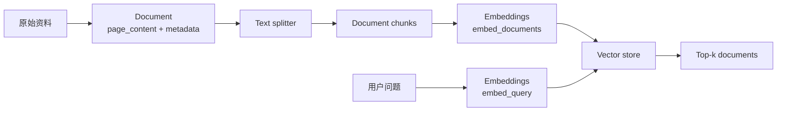
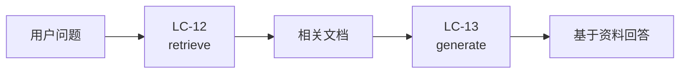

# LC-12：Retrieval 基础

## 1. 本阶段目标

本阶段进入 Retrieval（检索）主线，为后续 2-step RAG、Agentic RAG 和 Hybrid RAG 打基础。

最小目标：

- 理解 `Document` 是 LangChain 中承载知识内容和 metadata 的基础结构。
- 会用 text splitter 把长文本切成适合检索的小块。
- 理解 embeddings 把文本转成向量，vector store 负责保存向量并做相似度搜索。
- 会用 `InMemoryVectorStore` 做最小语义检索。
- 会区分 LC-11 的长期记忆 store 和 LC-12 的知识检索 vector store。
- 练习 Python 文件读写、列表处理和简单对象遍历。

## 2. 官方文档核对

本阶段优先核对 LangChain 官方文档：

- LangChain knowledge base / semantic search：`https://docs.langchain.com/oss/python/langchain/knowledge-base`
- Embedding models：`https://docs.langchain.com/oss/python/integrations/embeddings`
- Text splitters：`https://docs.langchain.com/oss/python/integrations/splitters`
- Vector stores：`https://docs.langchain.com/oss/python/integrations/vectorstores`
- `langchain-text-splitters` PyPI：`https://pypi.org/project/langchain-text-splitters/`

关键导入路径：

```python
from langchain_core.documents import Document
from langchain_core.embeddings import Embeddings
from langchain_core.vectorstores import InMemoryVectorStore
from langchain_text_splitters import RecursiveCharacterTextSplitter
```

关键结论：

- `Document` 至少包含 `page_content`，通常还会带 `metadata`，例如 `source`、`section`、`chunk_index`。
- `RecursiveCharacterTextSplitter` 来自独立包 `langchain-text-splitters`，本阶段已在 `pyproject.toml` 中补充 `langchain-text-splitters==1.1.2`。
- embedding 模型遵循 `Embeddings` 接口，核心方法是 `embed_documents(...)` 和 `embed_query(...)`。
- `InMemoryVectorStore` 适合学习和测试；生产环境通常会替换为 Chroma、FAISS、Postgres/pgvector、Milvus、Pinecone 等持久化或服务型 vector store。
- vector store 可以直接 `similarity_search(...)`，也可以转成 retriever：`vector_store.as_retriever(search_kwargs={"k": 3})`。

## 3. 核心概念

### 3.1 Retrieval 解决什么问题

LC-09 的上下文工程已经看过一个判断：不要把所有资料一次性塞进 prompt，而是按需加载少量相关材料。

Retrieval 负责回答这个问题：

> 用户现在问的问题，最应该让模型看到哪几段资料？

它不直接生成答案，而是把“相关内容”找出来，交给后续链路使用。到 LC-13 的 2-step RAG 时，流程会变成：

```text
用户问题 -> retrieve 相关文档 -> generate 基于文档回答
```

本阶段只做第一步：把知识材料变成可检索的结构，并观察检索结果。

### 3.2 Document

`Document` 是 LangChain 表示一段资料的通用对象。

```python
Document(
    page_content="LangChain agent 可以调用 tools 完成外部动作。",
    metadata={"source": "lc-notes", "section": "tools"},
    id="lc-tools-001",
)
```

其中：

- `page_content`：真正给模型看的文本。
- `metadata`：辅助定位、过滤和溯源的数据。
- `id`：可选的文档标识，便于后续更新、删除或和外部系统记录对应。

metadata 很重要。后续 RAG 回答时，除了给出答案，也常常需要告诉用户“依据来自哪里”。如果切分后丢掉来源，检索结果就会变成一堆没有出处的文本碎片。

### 3.3 Text splitter

真实文档通常比较长，不能直接整篇进入 embedding 或 prompt。Text splitter 负责把长文本切成 chunk。

本阶段使用：

```python
RecursiveCharacterTextSplitter(
    chunk_size=260,
    chunk_overlap=40,
    add_start_index=True,
)
```

几个参数先这样理解：

- `chunk_size`：每个 chunk 的目标长度。
- `chunk_overlap`：相邻 chunk 之间保留多少重叠内容，减少边界处语义被切断的问题。
- `add_start_index`：把 chunk 在原文中的起始字符位置写入 metadata，方便后续溯源和调试。
- `split_documents(...)`：输入 `Document` 列表，输出切分后的 `Document` 列表，并尽量保留 metadata。

chunk 不是越小越好。太小会丢上下文，太大会增加噪声和成本。LC-12 先观察现象，后续 RAG 阶段再调参。

官方文档建议一般文本优先从 `RecursiveCharacterTextSplitter` 开始，因为它会尽量保留段落、句子、词这类自然结构；只有在检索质量或成本需要调优时，再考虑 token-based、Markdown/HTML/code 等更专门的 splitter。

### 3.4 Embeddings

Embeddings 把文本变成一组浮点数，也就是向量。

直觉上：

- 意思接近的文本，向量距离更近。
- 意思无关的文本，向量距离更远。

官方接口里有两个核心方法：

```python
embed_documents(texts: list[str]) -> list[list[float]]
embed_query(text: str) -> list[float]
```

生产项目通常使用真实 embedding 模型，例如 OpenAI、DashScope、Voyage、Cohere 或本地 embedding 模型。本阶段骨架里提供一个极小的离线 `KeywordEmbeddings`，它不是生产级语义模型，只是为了让你先看懂 LangChain 的调用链：vector store 会在入库时调用 `embed_documents(...)`，查询时调用 `embed_query(...)`。

### 3.5 Vector store 与 retriever

Vector store 保存文本、metadata 和对应向量，并支持相似度搜索。

常见基础用法：

```python
docs = vector_store.similarity_search("什么是短期记忆？", k=3)
```

或者转成 retriever：

```python
retriever = vector_store.as_retriever(search_kwargs={"k": 3})
docs = retriever.invoke("什么是短期记忆？")
```

vector store 的常见能力包括：

- `add_documents(...)`：向索引中新增 `Document`。
- `delete(...)`：按 ID 删除文档，具体支持程度取决于 vector store 实现。
- `similarity_search(...)`：按语义相似度返回 top-k 文档。
- `similarity_search_with_score(...)`：返回文档和相似度分数，便于调试命中质量。
- `filter`：按 metadata 过滤，例如只查某个 `source` 或某类资料。

不同 vector store 的相似度指标和索引实现可能不同，常见指标包括 cosine similarity、Euclidean distance 和 dot product。LC-12 只需要知道这些差异会影响“相似”的计算方式，暂时不需要深入算法。

retriever 更像一个统一接口：输入一个自然语言 query，输出 `list[Document]`。vector store 可以转成 retriever，但 retriever 不一定来自 vector store，也可以封装外部搜索 API、数据库或自定义检索逻辑。后续 RAG、agent tool 和 LangGraph workflow 中，经常会把检索步骤抽象成 retriever。

### 3.6 Long-term memory store vs vector store

LC-11 的 `InMemoryStore` 和本阶段的 `InMemoryVectorStore` 名字相似，但职责不同。

| 对比项 | LC-11 long-term memory store | LC-12 vector store |
| --- | --- | --- |
| 主要问题 | 记住用户或应用的长期数据 | 从知识库中找相关材料 |
| 查询方式 | namespace + key，或 store search | embedding 相似度搜索 |
| 典型数据 | 用户偏好、profile、业务状态 | 文档 chunk、知识片段、引用来源 |
| 是否依赖 embedding | 不依赖 | 依赖 |
| 后续用途 | 个性化、跨 thread 状态 | RAG、知识问答、检索工具 |

一句话：long-term memory store 更像结构化记忆库，vector store 更像语义索引。

## 4. 图解

### 4.1 Retrieval 基础链路



### 4.2 Retrieval 与 RAG 的边界



LC-12 只要求你能拿到 `ContextDocs`。模型生成答案是下一阶段。

## 5. 手写实践任务

文件：

- `learning/LC_12_retrieval_basics/retrieval_basics_skeleton.py`
- `learning/LC_12_retrieval_basics/retrieval_basics_skeleton.origin.py`

实践目标：

1. 创建几条 `Document`，用 metadata 标记来源和主题。
2. 用 `RecursiveCharacterTextSplitter` 切分文档。
3. 使用离线 `KeywordEmbeddings` 创建 `InMemoryVectorStore`。
4. 调用 `similarity_search(...)` 或 retriever 的 `invoke(...)`。
5. 打印命中的 chunk 内容和 metadata，观察检索是否命中预期主题。

建议查询问题：

- `How does thread memory work?`
- `Where are user preferences stored?`
- `Why does retrieval split documents into vectors?`
- `Where do tools use runtime context?`

本阶段骨架里的 `KeywordEmbeddings` 只统计英文关键词，所以上面的查询先用英文。等换成真实 embedding 模型后，再比较中文查询和英文查询的命中差异。

观察重点：

- 同一份原始资料切分后会变成多少个 chunk。
- metadata 是否跟着 chunk 保留下来。
- `add_start_index=True` 是否为切分后的 chunk 增加了 `start_index`。
- `k` 从 1 改成 3 后，结果数量和噪声如何变化。
- 查询词越接近 chunk 关键词，离线 embedding 的命中越稳定；这也反过来说明真实 embedding 模型的价值。

## 6. Python 要点

### 6.1 文件读写

本阶段可以先用代码里的字符串列表作为资料源。补完基础流程后，再尝试把资料放进本地 `.md` 或 `.txt` 文件，用 `Path.read_text(encoding="utf-8")` 读取。

```python
from pathlib import Path

text = Path("notes.md").read_text(encoding="utf-8")
```

注意：文件路径建议用 `Path`，中文内容显式指定 `encoding="utf-8"`。

### 6.2 列表处理

Retrieval 会频繁处理 `list[Document]`：

```python
documents = build_source_documents()
chunks = splitter.split_documents(documents)
for index, doc in enumerate(chunks, start=1):
    print(index, doc.metadata, doc.page_content)
```

你要习惯两件事：

- 列表中的每个元素是对象，不是普通字符串。
- `Document` 的内容和 metadata 要分开看。

### 6.3 简单对象遍历

打印检索结果时，先不要只打印 `doc`，建议明确拆开：

```python
print(doc.page_content)
print(doc.metadata)
```

这样更容易观察 LangChain 对象里到底带了什么信息。

## 7. 阶段检查清单

- [ ] 能解释 `Document.page_content`、`Document.metadata` 和可选 `Document.id` 的作用。
- [ ] 能说明为什么需要 text splitter，以及 `chunk_overlap`、`add_start_index` 的价值。
- [ ] 能说出 `embed_documents` 和 `embed_query` 的区别。
- [ ] 能创建 `InMemoryVectorStore` 并做一次 top-k 检索。
- [ ] 知道 vector store 常见能力包括 `add_documents`、`delete`、metadata `filter` 和带 score 的相似度搜索。
- [ ] 能说明 retriever 比 vector store 更通用：输入 query，输出 `list[Document]`。
- [ ] 能区分 memory store 和 vector store。
- [ ] 能根据检索结果判断 chunk 参数或 query 写法是否需要调整。

## 8. 待实践记录

完成骨架后，回到这里记录：

- 切分前文档数量：
- 切分后 chunk 数量：
- 查询 1 命中的 top-k：
- 查询 2 命中的 top-k：
- 观察到的意外结果：
- 需要调整的参数：

## 9. 阶段总结

待实践完成后补充。
