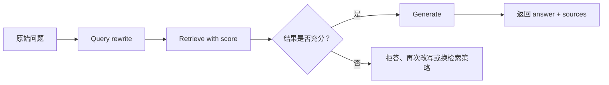

# LC-14：Agentic / Hybrid RAG

## 1. 本阶段目标

LC-13 实现了固定的 `retrieve -> generate`。本阶段继续观察：当问题不适合直接检索，或者应用**需要判断**“是否检索、检索结果是否够好”时，控制流应该放在哪里。

完成后，应能解释：

- 2-step RAG、Agentic RAG 与 Hybrid RAG 的主要区别。
- 为什么 retrieval tool 的描述会影响 agent 是否调用它。
- `content_and_artifact` 如何同时服务模型与应用层。
- query rewrite 改写的是检索表达，不应篡改用户原始问题。
- top-k 与“结果足够相关”为什么不是一回事。
- 什么时候 `create_agent` 已经够用，什么时候需要显式 workflow。

## 2. 官方文档核对

本阶段以当前 LangChain v1 官方文档为准：

- [Retrieval 概览](https://docs.langchain.com/oss/python/langchain/retrieval)
- [Build a RAG agent with LangChain](https://docs.langchain.com/oss/python/langchain/rag)
- [Custom workflow](https://docs.langchain.com/oss/python/langchain/multi-agent/custom-workflow)
- [Build a custom RAG agent with LangGraph](https://docs.langchain.com/oss/python/langgraph/agentic-rag)
- [Tools](https://docs.langchain.com/oss/python/langchain/tools)

以上页面已于 2026-06-19 直接访问 LangChain 官网核对。Context7 只用于辅助定位文档，不作为本阶段 API 结论的最终依据。

官方最小 Agentic RAG 的核心形式是：

```python
from langchain.agents import create_agent
from langchain.tools import tool


@tool(response_format="content_and_artifact")
def retrieve_context(query: str):
    ...
    return serialized_content, retrieved_documents


agent = create_agent(model=model, tools=[retrieve_context], system_prompt=...)
```

`serialized_content` 会作为工具结果交给模型，原始 `retrieved_documents` 则放在对应 `ToolMessage.artifact` 中，供应用层读取来源和 metadata。

官网的 custom RAG 教程进一步展示了 self-correction（自我纠正）流程：

1. 模型决定直接回答，还是生成 retrieval tool call。
2. 执行检索工具。
3. 使用 structured output 对检索文档做相关性 grading。
4. 相关则生成答案；不相关则改写问题并重新进入检索决策。
5. 最终仍根据原始问题和通过校验的 context 回答。

该教程使用 LangGraph 表达条件边与循环。本阶段先理解每个节点的职责，并用普通 Python 实现受限版本；完整图编排留到 LC-18。

> 本仓库固定使用 `langchain==1.3.9`。实践沿用已有 DeepSeek OpenAI-compatible 配置和离线 `KeywordEmbeddings`，重点学习控制流，不把教学 embedding 当作生产检索方案。

## 3. 三种 RAG 控制方式

### 3.1 2-step RAG

```text
question -> retrieve -> generate -> answer
```

- 每个问题都检索。
- 流程稳定，通常只进行一次 chat model generation。
- 原始问题表达不适合检索时，不会自动改写。
- top-k 结果即使无关，也可能被送入模型。

### 3.2 Agentic RAG

```text
question -> agent
               |
               +-- 可以直接回答
               |
               +-- 调用 retrieve_context(query)
                         |
                         +-- 观察结果后继续推理或再次调用
```

检索被包装成 tool。agent 决定：

- 是否需要检索。
- 使用什么 query。
- 是否需要再次检索。
- 何时根据工具结果生成最终答案。

灵活性的代价是模型调用次数、延迟与路径不再完全固定。工具名称、docstring、参数 schema 和 system prompt 都会影响 agent 的选择。

一次典型的 Agentic RAG 消息轨迹是：

```text
HumanMessage(original question)
    -> AIMessage(tool_calls=[...])
    -> ToolMessage(content=serialized context, artifact=raw documents)
    -> AIMessage(final answer)
```

若模型认为无需检索，轨迹可能只有 `HumanMessage -> AIMessage`。判断工具是否被调用，应检查 `AIMessage.tool_calls` 或实际出现的 `ToolMessage`，不能根据最终答案的措辞猜测。

### 3.3 Hybrid RAG

Hybrid RAG 把部分步骤交给模型，但由应用显式控制关键路径：



它适合需要以下能力的场景：

- 检索前规范化问题。
- 对检索结果设置分数或业务规则。
- 对失败路径设置次数上限。
- 保证某些步骤必定执行或禁止执行。
- 对延迟、成本和可观测性有更强要求。

本阶段先用普通 Python 编排一次线性流程。需要循环、分支、持久化状态时，再在 LC-18 使用 LangGraph。

官网列出的完整 Hybrid RAG 典型组件包括：

- **Query enhancement**：改写、扩展或生成多个 query。
- **Retrieval validation**：判断文档是否相关且足够。
- **Answer validation**：判断答案是否准确、完整并忠于来源。
- **Iterative refinement**：校验失败后再次改写、检索或生成。

当前骨架重点实践前两项。Answer validation 会在概念上补齐，但不在本阶段实现完整 grader 循环，避免提前展开 LangGraph 与评测体系。

## 4. Retrieval tool 的双重返回

### 4.1 给模型看的 content

工具应返回边界清楚的文本，例如：

```text
[Document 1]
source: lc-13
topic: two-step-rag
content: ...
```

这部分会进入模型上下文，因此需要：

- 控制长度。
- 保留必要来源。
- 将文档内容视为数据而不是指令。
- 无结果时明确返回“No relevant documents...”。

### 4.2 给应用看的 artifact

应用不能只相信模型复述的来源。`response_format="content_and_artifact"` 会把 tuple 的第二项保存为 `ToolMessage.artifact`：

```python
for message in result["messages"]:
    if isinstance(message, ToolMessage) and message.artifact:
        documents = message.artifact
```

这样最终回答与真实检索来源仍然可以分别处理：

```text
answer: AIMessage.text
sources: list[Document]
```

如果 agent 多次调用检索工具，结果中会出现多个 `ToolMessage`。提取来源时应考虑去重，而不是只读取最后一次调用。

`artifact` 供应用下游处理，**不会发送给模型**。如果模型回答需要某段内容，该内容必须出现在 tuple 第一项 `content` 中，不能只放进 artifact。

工具还有几个容易忽略的契约：

- 函数 type hints 用于生成参数 schema。
- 默认使用函数 docstring 作为工具描述，描述应准确说明“查什么”和“何时使用”。
- `response_format="content_and_artifact"` 要求函数严格返回二元 tuple。
- retrieval 结果还要交给模型推理，因此不应使用 `return_direct=True`。
- 生产环境应通过 tool middleware 处理超时、数据库异常等错误，避免一次检索异常直接终止 agent。

## 5. Query rewrite

Query rewrite 的目标是让检索器更容易找到资料，而不是替用户更换问题。

官网示例中存在两种放置方式：

- **Pre-retrieval rewrite**：检索前固定改写一次，适合规范化模糊问题；当前 Hybrid 骨架采用这种线性形式。
- **Corrective rewrite**：先检索并 grading，只有结果不相关时才改写，再回到检索决策；官方 LangGraph custom RAG 采用这种 self-correction 形式。

后者节省不必要的 rewrite，但需要条件分支、循环和最大重试次数等控制。

例如：

```text
原始问题：它们俩到底有什么区别？
对话背景：正在讨论 short-term memory 和 long-term memory
检索 query：short-term memory versus long-term memory scope thread store
```

应用应同时保留：

- `original_question`：最终回答必须解决的问题。
- `rewritten_query`：只用于 retrieval。

适合改写的内容包括：

- 补全上下文中省略的实体。
- 展开模糊代词。
- 加入知识库实际使用的术语。
- 删除无助于检索的客套表达。

不应做的事：

- 在改写时偷偷回答问题。
- 添加用户没有表达的事实。
- 把未知前提写成已知事实。
- 最终只回答 rewritten query 而忘记原问题。

## 6. Retrieval validation

`similarity_search(query, k=2)` 表示返回排名靠前的两个结果，不表示这两个结果一定相关。

本阶段使用 `similarity_search_with_score(...)` 观察：

```python
list[tuple[Document, float]]
```

对当前 `InMemoryVectorStore`，该值是 cosine similarity（余弦相似度），**越高表示越相似**，因此可以取最大值作为最佳 score。这个方向不能推广到所有 vector store：有些后端返回 distance（距离），数值反而越低越好。接入新后端时必须先查对应官方文档。

然后通过明确规则判断结果是否可用，例如：

- query embedding 不是全零向量。
- 至少有一条结果。
- 最佳 score 达到当前教学 embedding 的阈值。
- metadata 满足业务过滤条件。

阈值不是通用常量。更换 embedding、vector store、距离度量或知识库后，都需要用评测数据重新校准。

### 6.1 分数阈值与语义 grader

两种校验方式解决的问题不同：

| 方式 | 优点 | 限制 |
| --- | --- | --- |
| score threshold | 快、便宜、确定性强 | 依赖具体 embedding 与 score 语义，未必能判断“是否足以回答” |
| LLM semantic grader | 能比较原始问题与文档语义，可输出结构化 yes/no | 增加模型调用、延迟和不确定性 |

官网 custom RAG 教程定义 `GradeDocuments` schema，让模型返回相关性二元判断，再把结果路由到 generate 或 rewrite。实践骨架增加可选的 `grade_documents_semantically(...)`，用于对比它与固定阈值的差异。

语义 grader 的 prompt 也会读取检索文档，因此同样必须：

- 把文档放在清晰的 `<context>` 边界内。
- 明确要求把文档视为数据。
- 忽略文档中的指令与格式要求。
- 使用 constrained / structured output，避免靠自由文本解析 yes/no。

### 6.2 Answer validation

Retrieval validation 只说明“资料可能相关”，不保证最终答案正确。完整 Hybrid RAG 还可以在生成后检查：

- 答案是否真正回答原始问题。
- 关键陈述是否能由 context 支持。
- 是否遗漏必要信息。
- 是否出现 context 外的事实或伪造来源。
- 输出格式是否符合应用要求。

失败后可重新生成、换检索策略或返回保守答案。这个步骤会与 LC-17 Evaluation 和 LC-18 LangGraph 衔接，本阶段不实现循环。

校验失败后的策略可以是：

1. 明确说资料不足。
2. 再改写一次 query。
3. 更换关键词检索、向量检索或外部搜索。
4. 转人工处理。

练习骨架先实现“失败即拒答”，避免尚未学习图控制流时引入无上限循环。

## 7. 手写实践任务

文件：

- `agentic_hybrid_rag_skeleton.py`
- `agentic_hybrid_rag_skeleton.origin.py`

### 任务 A：构造 retrieval tool

1. 使用 `@tool(response_format="content_and_artifact")`。
2. 对零向量 query 返回空结果。
3. 序列化 `Document` 给模型。
4. 把原始 `list[Document]` 作为 artifact 返回。

### 任务 B：构造 Agentic RAG

1. 使用 `create_agent(...)` 注册 retrieval tool。
2. 在 system prompt 中声明何时必须检索。
3. 分别测试知识库问题、常识问题和未知问题。
4. 从 `ToolMessage.artifact` 提取真实来源。
5. 观察 agent 是否跳过检索、是否改写 tool query。

### 任务 C：构造 Hybrid RAG

1. 用 structured output 生成 `RewrittenQuery`。
2. 使用 rewritten query 做带 score 的检索。
3. 用明确阈值校验检索结果。
4. 可选：使用 structured output semantic grader 对比校验结论。
5. 校验失败时拒答，不调用最终 generation。
6. 校验通过时仍用 original question 生成答案。

## 8. 建议观察记录

完成代码后记录：

- 哪些问题触发了 retrieval tool，哪些没有。
- `AIMessage.tool_calls` 中的 query 是否等于原始问题。
- `ToolMessage.content` 与 `.artifact` 各自保存了什么。
- 完整 messages 中 `HumanMessage -> AIMessage(tool call) -> ToolMessage -> AIMessage` 的顺序。
- query rewrite 前后检索结果和 score 是否变化。
- 阈值过高与过低分别出现什么问题。
- score threshold 与 semantic grader 是否给出不同结论。
- Agentic 路径与 Hybrid 路径各调用了几次模型。
- 未知问题最终是“拒答”还是仍然引用了无关资料。

## 9. 当前阶段边界

本阶段不追求：

- 生产级 embedding 或 reranker。
- BM25 与向量检索的真正 ensemble。
- 无限制的 rewrite-retrieve 循环。
- answer grader、hallucination grader 的完整图流程。
- LangGraph 节点、边和持久化。

这些边界能让注意力集中在一个问题上：**RAG 的控制权究竟交给 agent，还是保留在应用 workflow 中。**
