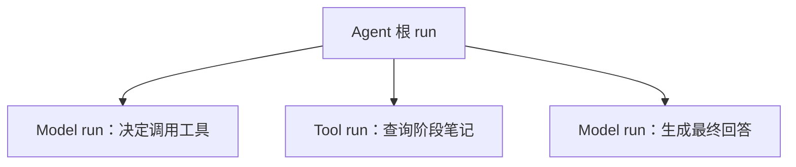
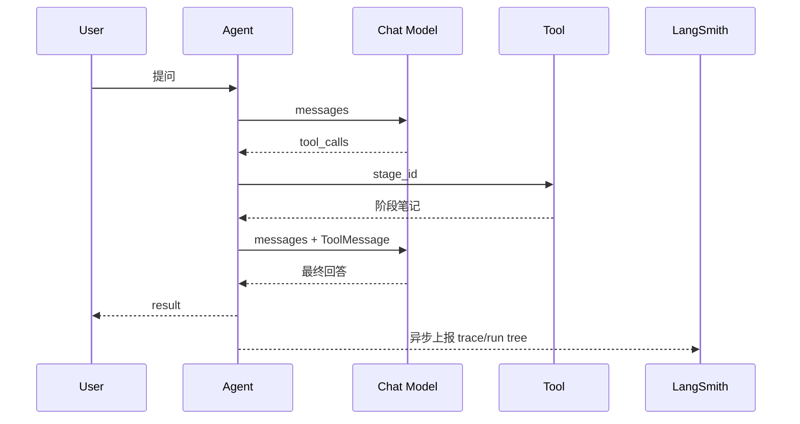
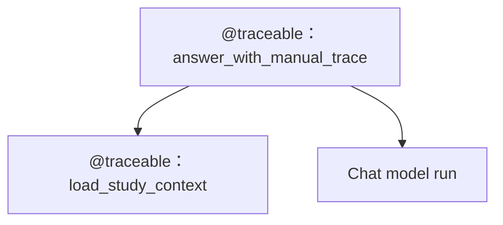

# LC-16：LangSmith Tracing

## 1. 本阶段目标

完成本阶段后，应能够：

1. 解释 observability（可观测性）、trace、run、span 和 project 的关系。
2. 使用环境变量为 LangChain agent 开启 LangSmith 自动 tracing。
3. 在 LangSmith UI 中定位一次完整的 `agent -> model -> tool -> model` 调用链。
4. 使用 `run_name`、`tags` 和 `metadata` 为 trace 添加便于筛选的业务信息。
5. 使用 `@traceable` 为普通 Python 函数手动埋点。
6. 观察 `@traceable` 父 run、普通函数子 run和 LangChain model run 的嵌套关系。
7. 理解 tracing 的异步上报、敏感数据和故障边界。

本阶段只学习 tracing 和基础 observability，不进入 dataset、evaluator、experiment 等离线评测内容；这些内容属于 LC-17。

## 2. 官方文档核对

本阶段以 LangSmith 官方文档为准：

- LangSmith Observability：
  <https://docs.langchain.com/langsmith/observability>
- Tracing quickstart：
  <https://docs.langchain.com/langsmith/observability-quickstart>
- Trace LangChain applications：
  <https://docs.langchain.com/langsmith/trace-with-langchain>

截至 2026-06-21，官方文档确认：

1. LangChain / LangGraph 应用可以通过环境变量直接开启 LangSmith tracing。
2. 核心环境变量是 `LANGSMITH_TRACING` 和 `LANGSMITH_API_KEY`。
3. `LANGSMITH_PROJECT` 用于把 traces 归入指定 project；未设置时会使用默认 project。
4. 非美国区域的账号可能还需要设置对应的 `LANGSMITH_ENDPOINT`。
5. LangChain runnable 可通过 `RunnableConfig` 设置 `run_name`、`tags` 和 `metadata`。
6. 普通 Python 函数可使用 `@traceable` 手动创建 run。
7. 在 `@traceable` 函数内部调用 LangChain 对象时，LangChain run 会自动成为它的 child run。
8. Python tracing 默认可能在后台线程中上报；短生命周期脚本退出前可调用
   `wait_for_all_tracers()` 等待上报完成。

## 3. 为什么需要 tracing

普通日志通常能回答：

- 程序执行到了哪里？
- 某个变量或异常是什么？
- 某个函数是否被调用？

LLM 应用还需要回答：

- agent 为什么决定调用工具？
- 模型第一次输出了什么 `tool_calls`？
- 工具收到了什么参数，返回了什么结果？
- 最终回答使用了哪次工具结果？
- 一次请求内部调用了几次模型，各自耗时多少？
- 错误发生在 agent、model、tool，还是 tracing 上报阶段？

LangSmith tracing 会把一次请求中的父子调用组织成 run tree（运行树），比只打印最终答案更容易**定位行为**。

## 4. 核心概念

### 4.1 Trace

trace 表示一次端到端请求的**完整执行记录**。

例如，用户问 agent 一个问题，从收到输入到返回最终回答，整体可以视为一个 trace。

### 4.2 Run / Span

run 表示 trace 中的一个**执行单元**。文档和可观测性系统中也常把这种单元称为 span。

一次 agent trace 可能包含：

- agent 根 run
- 第一次 model run
- tool run
- 第二次 model run

父子关系比单纯的时间顺序更重要，因为它能表示“谁触发了谁”。



### 4.3 Project

project 是 traces 的**逻辑分组**，不等同于本地代码仓库。

本阶段建议使用：

```text
langchain-learning-lc16
```

这样不会把练习 trace 混入 LangSmith 的默认 project。

### 4.4 Tags 与 Metadata

`tags` 是字符串标签，适合**分类和筛选**，例如：

```python
["lc-16", "agent", "automatic-tracing"]
```

`metadata` 是键值信息，适合记录**结构化上下文**，例如：

```python
{
    "stage": "LC-16",
    "practice": "agent",
    "environment": "local",
}
```

它们用于观察和筛选，不应放 API Key、密码或不必要的个人数据。

## 5. 自动 tracing

### 5.1 环境变量

请学习者在本地 `.env` 中手动配置：

```dotenv
LANGSMITH_TRACING=true
LANGSMITH_API_KEY=<你的 LangSmith API Key>
LANGSMITH_PROJECT=langchain-learning-lc16
```

可选配置：

```dotenv
# 一个 API Key 关联多个 workspace 时按需设置
LANGSMITH_WORKSPACE_ID=<你的 workspace ID>

# 非默认区域账号按官方页面提供的区域地址设置
LANGSMITH_ENDPOINT=<你的区域 API endpoint>
```

注意：

- `.env` 已被 `.gitignore` 忽略，不要把真实 API Key 写入学习文档或骨架。
- 不要打印 `LANGSMITH_API_KEY`。
- `LANGSMITH_TRACING=true` 只负责开启 tracing，不会替代模型 provider 的 API Key。
- 本仓库仍使用现有 DeepSeek OpenAI-compatible 模型配置。

### 5.2 为什么 LangChain agent 不需要逐个手动埋点

LangChain 的 model、tool、agent 等组件本身支持 callback/tracing 集成。开启 tracing 后，正常调用 **agent** 即可产生层级化 runs。

本阶段第一条实践链路为：



## 6. RunnableConfig 中的观察信息

`Runnable` 是 LangChain 对“可执行组件”的统一抽象。只要一个组件能够接收输入并产生输出，就可以按 Runnable 的方式调用。如Chat Model、Prompt Template、Output Parser、Retriever、组合起来的 Chain、`create_agent()` 返回的 agent graph

调用 agent 时可以传入配置：

```python
config = {
    "run_name": "lc16-agent-trace",
    "tags": ["lc-16", "agent", "automatic-tracing"],
    "metadata": {
        "stage": "LC-16",
        "practice": "agent",
        "environment": "local",
    },
}
```

需要注意：

1. `run_name` 主要修改当前被调用 runnable 的名称，不会自动重命名所有 child runs。
2. 根 runnable 上的 `tags` 和 `metadata` 可被 child runs 继承。
3. metadata 应保持低基数、可筛选，并避免敏感信息。
4. tracing 信息不应改变 agent 的业务输入和输出。

## 7. 使用 `@traceable` 手动埋点

自动 tracing 适合 LangChain 组件；`@traceable` 适合把普通 Python 业务函数也纳入同一棵 run tree。

本阶段将练习两个普通函数：

1. `load_study_context(stage_id)`：模拟加载学习资料。
2. `answer_with_manual_trace(question, stage_id)`：组织 context 并调用 chat model。

预期结构：



装饰器可配置名称、run 类型、tags 和 metadata，例如：

```python
@traceable(
    name="load-study-context",
    run_type="retriever",
    tags=["lc-16", "manual-tracing"],
    metadata={"stage": "LC-16"},
)
```

`run_type` 用于表达该 run 的**语义**。练习中把资料加载函数标记为 `retriever`，重点是观察 UI 中的分类和层级，不代表它已经是完整的向量检索器。

外层函数可再次使用 `@traceable`。当外层函数调用内层 `@traceable` 函数和 LangChain model 时，它们应显示为外层 run 的 children。

## 8. 自动 tracing 与手动埋点的边界

| 方式 | 适用场景 | 优点 | 注意点 |
| --- | --- | --- | --- |
| 环境变量自动 tracing | LangChain / LangGraph 组件 | 启动快，自动形成调用树 | 普通 Python 业务步骤未必有独立 run |
| `RunnableConfig` | 单次 runnable / agent 调用 | 可设置名称、tags、metadata | 主要作用于**当前调用**及其继承关系 |
| `@traceable` | 普通 Python 函数、自定义 pipeline | 能表达业务边界和父子层级 | 不宜给每个微小函数都埋点 |
| `tracing_context` | 临时启停或动态选择 project | 控制范围灵活 | 本阶段只作为扩展阅读 |

建议只给有观察价值的业务边界埋点，例如检索、路由、外部 API、关键数据转换。给每个辅助函数都加 `@traceable` 会让 run tree 变得嘈杂。

## 9. 手写实践任务

实践文件：

```text
learning/LC_16_langsmith_tracing/langsmith_tracing_skeleton.py
```

### 任务 A：手动配置 LangSmith

1. 注册或登录 LangSmith。
2. 创建 API Key。
3. 在本地 `.env` 中配置 tracing、API Key 和 project。
4. 确认没有把密钥写入代码、文档或 Git。

### 任务 B：自动追踪 tool agent

1. 补全 `build_agent()`。
2. 使用一个已提供的 `lookup_stage_note` 工具。
3. 补全 `run_agent_trace()`。
4. 在 agent 调用时传入 `run_name`、`tags` 和 `metadata`。
5. 在 LangSmith UI 中找到完整的 model/tool 调用树。

建议问题：

```text
请查询阶段笔记，说明 LC-15 学习了什么。必须先调用工具。
```

### 任务 C：使用 `@traceable` 手动埋点

1. 给 `load_study_context()` 添加 `@traceable`。
2. 给 `answer_with_manual_trace()` 添加 `@traceable`。
3. 在外层函数中调用资料加载函数和 chat model。
4. 观察普通函数 run 与 model run 的父子关系。

建议问题：

```text
根据给定阶段资料，用一句话说明 LC-16 的目标。
```

### 任务 D：确保短脚本完成 trace 上报

在程序退出前调用：

```python
wait_for_all_tracers()
```

建议放在 `try/finally` 的 `finally` 中，确保业务调用抛出异常时仍尝试等待已产生的 traces 上报。

## 10. 建议观察记录

完成代码后，至少记录：

1. agent 根 run 的名称、输入和输出。
2. 第一次 model run 是否产生 `tool_calls`。
3. tool run 的输入、输出和耗时。
4. 第二次 model run 如何使用工具结果。
5. 根 run 上的 tags / metadata 是否被 child runs 继承。
6. `@traceable` 外层函数、资料加载函数和 model run 的层级。
7. 自动 tracing 与手动埋点在代码侵入性上的区别。
8. 关闭 `LANGSMITH_TRACING` 后，本地业务功能是否仍能正常运行。

## 11. 故障边界与隐私

### 11.1 认证错误

常见原因：

- `LANGSMITH_API_KEY` 未配置或无效。
- API Key 属于其他区域，但没有设置正确的 `LANGSMITH_ENDPOINT`。
- API Key 关联多个 workspace，但没有选择正确的 workspace。

### 11.2 Trace 没有立即出现

Python tracing 可能在后台线程中上报。短脚本可使用 `wait_for_all_tracers()`，但网络和服务端处理仍可能造成短暂延迟。

### 11.3 模型调用成功但 tracing 失败

模型 provider 与 LangSmith 是两个外部系统：

- `DEEPSEEK_API_KEY` 等模型配置负责业务调用。
- `LANGSMITH_API_KEY` 负责 trace 上报。

两者的认证、网络和配额错误应分别判断。

### 11.4 敏感数据

trace 可能包含：

- system prompt 和用户输入
- 工具参数与工具结果
- 模型输出
- metadata

不要为了方便观察而上传真实密钥、密码或不必要的隐私数据。生产场景还需要继续学习数据脱敏、采样和保留策略，本阶段不展开。

## 12. 当前阶段边界

本阶段包括：

- 自动 tracing
- run tree
- project
- `run_name`
- tags / metadata
- `@traceable`
- trace 上报等待
- 基础排错与隐私意识

本阶段不包括：

- dataset
- evaluator
- experiment
- online evaluation
- dashboard / alert
- distributed tracing
- 自托管 LangSmith

下一阶段 LC-17 将在 tracing 的基础上学习 LangSmith Evaluation。

## 13. 实践记录

完成手写实践后补充：

- 实际使用的 project 名称
- agent trace 的 run tree
- `@traceable` 的父子 run 结构
- tags / metadata 的继承观察
- 遇到的问题及解决过程

## 14. 阶段总结

完成实践后补充本阶段最终总结。
