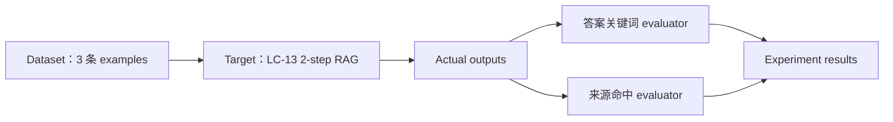

# LC-17：LangSmith Evaluation

## 1. 本阶段目标

完成本阶段后，应能够：

1. 解释 dataset、example、target function、evaluator 和 experiment 的关系。
2. 使用 `langsmith.Client` 创建一个小型离线评测数据集。
3. 把 LC-13 的 2-step RAG 包装成符合评测要求的 target function。
4. 编写至少两个确定性 evaluator，分别检查回答内容与检索来源。
5. 使用 `client.evaluate(...)` 运行 experiment，并在 LangSmith UI 中比较每条样例的结果。
6. 理解离线评测适合回归测试，但少量样例与关键词判断不能代表完整质量。

本阶段先完成 deterministic evaluation（确定性评测）。LLM-as-judge、pairwise comparison（两两比较）、
在线评测和复杂统计分析只作为后续扩展，不放进第一轮手写实践。

## 2. 官方文档核对

本阶段以 LangSmith 官方文档为准：

- Evaluation 总览：
  <https://docs.langchain.com/langsmith/evaluation>
- Evaluation quickstart：
  <https://docs.langchain.com/langsmith/evaluation-quickstart>
- Evaluate an application：
  <https://docs.langchain.com/langsmith/evaluate-llm-application>
- Manage datasets：
  <https://docs.langchain.com/langsmith/manage-datasets>

截至 2026-06-21，官方文档确认：

1. 离线评测的核心组成是 dataset、target function 和 evaluators。
2. dataset 由 examples 组成；每条 example 通常包含 `inputs` 和可选的
   `outputs`（reference outputs，参考输出）。
3. target function 接收一条 example 的 inputs，并返回字典形式的 outputs。
4. evaluator 可以读取 `inputs`、target 的 `outputs` 和 `reference_outputs`，
   返回布尔值、分数或带 key/score 的结果。
5. `Client.evaluate(...)` 会对数据集逐条运行 target 和 evaluators，并把结果记录为 experiment。
6. `experiment_prefix`、`description` 和 `metadata` 可用于识别与比较不同实验。

## 3. 核心概念

### 3.1 Dataset 与 Example

dataset 是一组固定的**测试案例**。example 是其中一条案例：

```python
{
    "inputs": {
        "question": "What isolates short-term memory conversations?"
    },
    "outputs": {
        "required_keywords": ["thread_id"],
        "expected_sources": ["lc-10"],
    },
}
```

这里的 `outputs` 不是模型实际回答，而是评测时使用的 reference outputs。

### 3.2 Target Function

target function 是“被测系统”的统一入口：

```python
def rag_target(inputs: dict) -> dict:
    question = inputs["question"]
    answer, documents = answer_question(...)
    return {
        "answer": answer,
        "sources": [document.metadata["source"] for document in documents],
    }
```

它只关心一条输入如何变成一条实际输出。LangSmith 负责遍历数据集、记录运行结果并调用 evaluators。

### 3.3 Evaluator

evaluator 用明确规则判断一条输出是否满足某个维度。

本阶段使用两个 evaluator：

- `answer_contains_required_keywords`：回答是否包含所有**必要关键词**。
- `retrieved_expected_source`：实际检索来源是否包含**期望来源**。

两个维度应分开记录。否则，只得到一个总分时，很难判断失败来自 retrieval 还是 generation。

### 3.4 Experiment

experiment（实验） 是“某个 target 版本在某个 dataset 上的一次完整运行”。



同一数据集可以反复运行不同 prompt、model、retrieval `k` 或代码版本，然后比较实验结果。

## 4. 为什么复用 LC-13

LC-13 已经提供：

- 固定知识文档。
- 可重复构造的 vector store。
- `retrieve -> format -> generate` 流程。
- 同时返回 answer 和真实 documents 的 `answer_question(...)`。

这让 LC-17 能把注意力放在“如何评测”，而不是重新实现 RAG。尤其是保留真实 documents，
可以单独评价 retrieval，不必让模型自己声称使用了哪些来源。

## 5. 手写实践任务

骨架文件：

- `langsmith_evaluation_skeleton.py`
- `langsmith_evaluation_skeleton.origin.py`

建议按以下顺序补全：

1. 手动确认 `.env` 中已有 `LANGSMITH_API_KEY`。
2. 创建 `Client` 并上传 3 条 evaluation examples。
3. 构造一次可复用的 model 和 vector store。
4. 完成 `rag_target(inputs)`，返回 `answer` 和 `sources`。
5. 完成答案关键词 evaluator。
6. 完成检索来源 evaluator。
7. 调用 `client.evaluate(...)` 运行 experiment。
8. 在 LangSmith UI 中观察逐条结果、错误、耗时和 evaluator 分数。

> 数据集创建只需执行一次。重复运行前，可在 UI 中复用已有 dataset，或临时修改
> `DATASET_NAME`，避免重复创建同名数据集造成困惑。

## 6. 重点观察

运行后重点回答：

1. target function 收到的是整条 example，还是仅 `inputs`？
2. target 返回的 `sources` 来自真实 documents，还是模型生成文本？
3. 某条样例失败时，是关键词 evaluator 失败，还是来源 evaluator 失败？
4. 未知问题是否检索到了低相关文档？这会怎样影响来源命中指标？
5. 相同 dataset 更换 model、prompt 或 `k` 后，experiment 是否方便比较？
6. evaluator 本身是否可能误判？

## 7. 评测边界

### 7.1 关键词命中不等于语义正确

回答包含 `thread_id`，不代表它正确解释了 thread isolation。**关键词 evaluator** 的优点是便宜、
稳定、易排错；缺点是**不能理解完整语义**。

### 7.2 来源命中不等于回答 grounded

检索到了正确文档，不代表最终回答忠实使用了该文档。retrieval 和 generation 应拆成不同指标。

### 7.3 三条数据只是教学闭环

最小数据集用于熟悉 API，不足以代表真实质量。后续项目中应**逐步加入**：

- 正常问题、**边界问题和未知问题**。
- 不同**表达方式**与语言。
- 容易混淆的**相邻概念**。
- 生产 traces 中发现的**真实失败案例**。

### 7.4 数据与密钥安全

不要把 API Key 写进 dataset、metadata、inputs 或 outputs。上传真实业务样例前，还要检查隐私信息、
内部文档和用户数据是否允许进入 LangSmith。

## 8. 阶段完成标准

满足以下条件后，可完成 LC-17：

1. LangSmith 中存在一个包含 3 条样例的 dataset。
2. target function 能返回结构稳定的 `answer` 和 `sources`。
3. 至少两个 evaluator 能分别输出评测结果。
4. 成功产生一个 experiment，并能解释逐条结果。
5. 能指出确定性 evaluator 的至少两个局限。

## 9. 实践记录

### 9.1 实际完成内容

本次实践复用了 LC-13 的 2-step RAG，并完成：

1. 通过 `Client.create_dataset(...)` 创建 `lc17-rag-mini-eval` dataset。
2. 通过 `Client.create_examples(...)` 批量上传 3 条 examples。
3. 在 experiment 开始前构造一次 model 和 vector store，供 3 次 target 调用复用。
4. 使用 `rag_target(inputs)` 接收每条 example 的 `inputs`，返回实际 `answer` 和真实检索 `sources`。
5. 编写 `answer_contains_required_keywords`，检查回答是否包含 reference outputs 中要求的关键词。
6. 编写 `retrieved_expected_source`，检查真实检索来源是否覆盖期望来源。
7. 使用 `Client.evaluate(...)` 运行 experiment：
   `lc17-rag-mini-eval-97ddfa43`。

### 9.2 LangSmith 观察结果

LangSmith UI 中显示：

- 3 / 3 runs 全部执行完成。
- `answer_contains_required_keywords` 平均分为 `1.00`。
- `retrieved_expected_source` 平均分为 `1.00`。
- 三条 run 的 latency 分别约为 `1.80s`、`1.32s` 和 `1.08s`，P50 约为 `1.32s`。
- 每条 run 都能同时查看 inputs、reference outputs、实际 outputs、两个 evaluator 分数和耗时。

这次结果说明：在当前 3 条教学样例中，模型回答都包含要求的关键词，检索结果也都包含期望来源。
它不能说明 RAG 已在所有问题上达到 100% 正确，因为样例数量少，而且两个 evaluator 只检查了有限维度。

### 9.3 实际调用关系

```text
dataset 中的一条 inputs
    -> rag_target(inputs)
    -> LC-13 answer_question(...)
    -> {"answer": ..., "sources": [...]}
    -> 两个 evaluator 分别评分
    -> LangSmith 保存为一条 experiment run
```

`target function` 在这里就是被评估的函数。LangSmith 对数据集中的每条输入调用它，再把它返回的结果交给
evaluators 检查。

## 10. 排错记录

### 10.1 `create_example()` 不接受 `examples`

错误写法：

```python
client.create_example(dataset_id=dataset.id, examples=EVALUATION_EXAMPLES)
```

`create_example()` 用于创建一条 example；批量上传应使用：

```python
client.create_examples(
    dataset_id=dataset.id,
    examples=EVALUATION_EXAMPLES,
)
```

由于 dataset 在报错前已经创建，重新执行创建逻辑前需要先确认 LangSmith 中是否已有同名 dataset。

### 10.2 `Client.evaluate()` 提示缺少 `target`

当前 SDK 的 `target` 是 positional-only parameter（仅限位置参数），因此不能写成：

```python
client.evaluate(target=rag_target, ...)
```

正确写法：

```python
client.evaluate(rag_target, ...)
```

函数签名中的 `/` 表示它前面的参数必须按位置传入。

### 10.3 evaluator 的 IDE 类型提示

LangSmith 运行时能够把 `bool` evaluator 结果转换为分数，但当前 SDK 类型声明没有完整表达这一点，
PyCharm 会显示类型警告。实践改为返回结构明确的字典：

```python
{
    "key": "retrieved_expected_source",
    "score": True,
}
```

这样既消除了类型歧义，也能在 LangSmith UI 中直接显示指标名称。

### 10.4 模块级依赖的 `None` 类型提示

`MODEL` 和 `VECTOR_STORE` 初始值为 `None`，应明确标注它们后续可能保存的类型：

```python
MODEL: BaseChatModel | None = None
VECTOR_STORE: InMemoryVectorStore | None = None
```

调用前使用 `is None` 明确排除未初始化情况，IDE 才能继续缩小变量类型。

## 11. 阶段总结

本阶段完成了最小离线评测闭环：

```text
固定测试数据 -> 执行被评估函数 -> 生成实际输出 -> evaluator 评分 -> experiment 对比
```

核心收获：

1. dataset 保存固定问题和 reference outputs，使不同版本能使用相同测试条件。
2. target function 负责运行被评估代码，本阶段就是包装后的 LC-13 RAG。
3. evaluator 应按**不同质量维度**拆分，便于区分 retrieval 与 generation 的问题。
4. experiment 保存一次完整评测，可继续比较不同 model、prompt、检索参数或代码版本。
5. `1.00` 只表示通过了当前 evaluator 和当前 3 条 examples，不等于系统整体质量为 100%。
