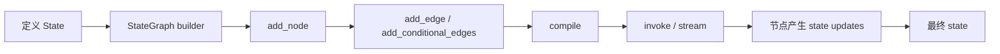
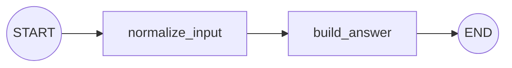
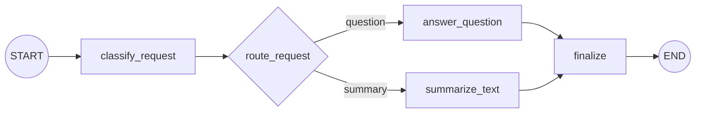
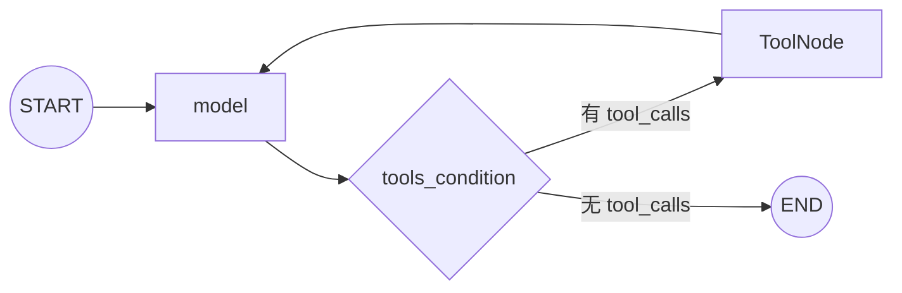

# LC-18：LangGraph 入门

## 1. 本阶段目标

完成本阶段后，应能够：

1. 解释 graph、state、node、edge、`START`、`END` 的职责。
2. 使用 `StateGraph` 构建、编译并调用工作流。
3. 理解节点读取当前 state、返回局部更新。
4. 区分默认覆盖与 reducer 合并更新。
5. 使用 `add_conditional_edges(...)` 构建 Router。
6. 使用 `MessagesState`、`ToolNode` 和 `tools_condition` 构建 model/tool 循环。
7. 判断何时使用 `create_agent`，何时直接使用 LangGraph。

本阶段暂不展开 persistence、interrupt、streaming、subgraph 和 multi-agent。

## 2. 官方文档核对

- Graph API overview：<https://docs.langchain.com/oss/python/langgraph/graph-api>
- Use the Graph API：<https://docs.langchain.com/oss/python/langgraph/use-graph-api>
- Workflows and agents：<https://docs.langchain.com/oss/python/langgraph/workflows-agents>
- Python API reference：<https://reference.langchain.com/python/langgraph/>

截至 2026-06-22，官方文档确认：

1. `StateGraph` 是 Graph API 的主要图类。
2. 核心组成是 state、nodes 和 edges。
3. 节点是普通 Python **函数**，可以包含纯代码、模型调用或副作用。
4. 节点通常**返回** state 的局部更新，不必返回完整 state。
5. 没有 reducer 时新值**覆盖**旧值；声明 reducer 后按 reducer **合并**。
6. `START` 表示输入进入图的位置，`END` 表示终止位置。
7. 图必须先 `compile()`，再 `invoke()` 或 `stream()`。
8. `add_conditional_edges(...)` 根据**路由函数**返回值选择下一节点。
9. `MessagesState` 已提供带 `add_messages` **reducer** 的 `messages` 字段。
10. `ToolNode` 可执行工具并把工具结果写回消息 state。

## 3. 核心心智模型

### 3.1 State：当前快照

state 是节点之间共享的数据协议：

```python
class StudyState(TypedDict):
    raw_text: str
    normalized_text: str
    answer: str
```

`TypedDict` 主要提供结构与类型提示，运行时仍是普通 `dict`。

### 3.2 Node：做工作

```python
def normalize_text(state: StudyState) -> dict[str, str]:
    return {"normalized_text": state["raw_text"].strip()}
```

节点读取当前 state，只返回自己负责的更新字段。建议**返回新字典**，不依赖原地修改 state。

### 3.3 Edge：决定下一步

普通 edge 表示固定顺序；conditional edge 根据 state 选择下一步。

> Node 做工作，edge 决定接下来去哪里。

### 3.4 构建与执行



`StateGraph(State)` 是构建器；`compile()` 后才得到可执行图。

### 3.5 `graph.invoke()` 与 `agent.invoke()`

`create_agent(...)` 返回的 agent 本身也是一个编译后的 LangGraph。普通 graph 和预构建 agent 都遵循 Runnable 调用形式：

```python
graph.invoke(input, config=None)
agent.invoke(input, config=None)
```

两者不是使用不同的 `invoke()` 规则。真正的区别是：

> 输入结构由图的 state schema 决定，返回值是图执行结束时的最终 state。

#### 普通 Graph

如果图使用：

```python
class LinearState(TypedDict):
    raw_text: str
    trace: Annotated[list[str], add]
```

调用时就传入这份 state 所需的字段：

```python
result = graph.invoke({
    "raw_text": "  LangGraph  ",
    "trace": [],
})
```

返回值也是 `LinearState` 的最终快照，可能包含节点后来写入的`normalized_text`、`answer` 等字段。

#### 预构建 Agent

agent 通常使用以 `messages` 为核心的 state：

```python
result = agent.invoke({
    "messages": [
        {"role": "user", "content": "LC-18 学什么？"}
    ]
})
```

因此返回 state 中也主要通过 `messages` 保存 `HumanMessage`、`AIMessage` 和`ToolMessage`。如果创建 agent 时扩展了自定义 state schema，输入和返回值也**可以包含其他字段**。

#### `input` 与 `config` 不要混淆

`input` 是进入图的**业务 state**；`config` 是**本次运行的配置**，config 不属于业务 state。

```python
graph.invoke(
    {"messages": [("user", "你好")]},
    config={
        "configurable": {"thread_id": "thread-1"},
        "tags": ["lc-18"],
    },
)
```

- `messages` 会进入 state，并被节点读取或更新。
- `thread_id` 可供 checkpointer 区分会话。
- `tags` 可用于 tracing 和运行标记。（langsmith）
- 后两者不会因为传入 `config` 就自动变成 state 字段。

所以看到任何 `.invoke(...)` 时，先问两个问题：

1. 这个 Runnable 背后的 state schema 是什么？
2. 哪些值是**业务输入**，哪些值只是**运行配置**？

## 4. 状态更新与 Reducer

默认情况下，节点返回的新字段值会**覆盖**旧值：

```python
class State(TypedDict):
    status: str
```

若需要**累计列表**，可给**单个字段**声明 reducer：

```python
from operator import add
from typing import Annotated

class State(TypedDict):
    trace: Annotated[list[str], add]
```

旧值 `["normalize"]` 加上更新 `["answer"]`，结果为
`["normalize", "answer"]`。Reducer 属于具体 state 字段。

**模型消息**通常使用 `add_messages` reducer。可以自行声明，也可以继承 `MessagesState`。

## 5. 实践一：纯 Python 直线图



重点观察：

1. 第一个节点只返回 `normalized_text` 和自己的 trace（执行轨迹）。
2. 第二个节点能读取前一节点**更新后的** state。
3. 最终 state 保留输入字段与所有节点产生的字段。
4. `trace` 使用 reducer 后**累计**，而不是被覆盖。

先不接模型，是为了看清图如何移动、state 如何变化。

## 6. 实践二：Router 条件分支



- `classify_request` 是 node：做分类并更新 `intent`（意图）。
- `route_request` 是 routing function：读取 state 并返回**下一跳**标识。
- `add_conditional_edges(...)` 把标识**映射**到节点名。
- `finalize` 演示不同分支重新**汇合**和公共后处理。

## 7. 实践三：Model 与 Tool



### Model 节点

```python
model_with_tools = model.bind_tools(tools)

def call_model(state: MessagesState):
    response = model_with_tools.invoke(state["messages"])
    return {"messages": [response]}
```

模型产生 `tool_calls` 只代表“请求调用”，工具尚未执行。

### ToolNode

`ToolNode(tools)` 读取最后一条 AI message 的 tool calls，执行对应工具，生成
`ToolMessage` 并写回 messages。

### tools_condition

`tools_condition` 根据最后一条 AI message 决定：

- 有 tool calls：进入 `"tools"`。
- 无 tool calls：进入 `END`。

工具执行后必须回到 model，让模型读取 `ToolMessage` 并形成最终回答。

## 8. 与 `create_agent` 的边界

优先使用 `create_agent`：

- 需求就是常见 model + tools 循环。
- 不需要复杂业务状态和特殊分支。
- 希望用**更少代码获得标准 agent 行为**。

考虑直接使用 `StateGraph`：（更底层）

- 固定步骤与 agent 决策混合。
- 存在多个条件分支、循环或汇合点。
- 除 messages 外还需维护文档、审批结果、重试次数等状态。
- 需要精确规定工具调用前后的业务流程。

两者不是竞争关系；**LangChain 的 agent 构建在 LangGraph 之上**。

## 9. 常见错误

1. 在 builder 上直接 `invoke()`：应先 `compile()`。
2. 节点返回裸字符串或 `None`：普通节点应**返回 state** 更新字典。
3. 总是返回完整 state：容易**误覆盖**其他更新，优先返回**局部字段**。
4. **原地修改** state：会模糊输入快照与输出更新的边界。
5. 路由返回值与映射**键不一致**：可用 `Literal[...]` 降低拼写错误。
6. ToolNode 后直接结束：模型无法**读取工具结果**并组织最终回答。
7. messages 使用默认**覆盖**：优先使用 `MessagesState` 或 `add_messages`。
8. 图拆得过细：节点应对应有意义的工作或控制边界。

## 10. 手写顺序

1. 完成**直线图**的两个节点、edges、compile 和 invoke。
2. 解释最终 state 中每个字段来自哪里。
3. 完成 Router 分类、路由、两个分支和汇合节点。
4. 分别输入 question 和 summary，观察 trace。
5. 完成 model 节点、`ToolNode`、`tools_condition` 和回环 edge。
6. 分别测试普通问题和需要工具的问题，观察消息类型顺序。

## 11. 阶段完成标准

能够回答：

1. 为什么节点可以只返回部分字段？
2. reducer 属于 graph、node，还是 state 字段？
3. Router 函数和普通 node 有什么不同？
4. 为什么工具执行后还要回到 model？
5. `create_agent` 已能运行工具时，为什么还要学习 LangGraph？

并亲手完成直线图、Router 图和最小 model/tool 循环图。

## 12. 学习过程记录

- 实际运行输出：直线图最终得到 `raw_text`、`normalized_text`、`answer` 和累计后的 `trace`；Router 图的 question 与 summary 输入分别经过对应分支并在 `finalize` 汇合。

- state 更新观察：节点读取完整 state，但只返回自己负责的局部更新；普通字段默认覆盖，`trace: Annotated[list[str], add]` 按节点执行顺序累计。

- Router 分支观察：`classify_request` 作为 node 更新 `intent` 并写入 trace；`route_request` 作为 routing function 只返回路由标识，不产生 state 更新；两个分支统一写入 `branch_result`，因此 `finalize` 无须判断结果来自哪个分支。

- model/tool 消息链：普通问题为 `HumanMessage -> AIMessage`；需要工具时为 `HumanMessage -> AIMessage(tool_calls) -> ToolMessage -> AIMessage`。`call_model` 负责在 `ModelToolState` 与绑定工具后的模型之间适配输入输出，`ToolNode` 执行工具，`tools_condition` 决定进入工具节点或结束。

- `invoke` 对照：普通 graph 与 `create_agent` 返回的 agent 都使用 Runnable 的 `invoke(input, config=None)` 形式，具体输入与最终返回结构由各自的 state schema 决定；`config` 是运行配置，不属于业务 state。

- 遇到的问题与修复：曾误用 Python 3.14 `asyncio.print_call_graph` 打印 LangGraph state，因其要求 `asyncio.Future` 而报错，改为普通 `print()`；修正 Router demo 中 question/summary 变量名与输入对应关系；明确 `create_agent(model=model, tools=tools)` 在内部处理工具绑定，而手写图需要显式调用 `model.bind_tools(tools)`。

- 验证结果：直线图与 Router 图通过本地实际调用和断言；model/tool 图使用不联网的假模型验证了直接回答路径与完整工具调用路径，自定义 `request_id` 也随最终 state 保留。

  

  最终总结：LangGraph 将应用表示为“state 保存快照、node 产生局部更新、edge 决定下一步”的图。预构建 agent 适合标准 model/tool 循环，自定义 `StateGraph` 则适合需要显式状态、分支、循环与业务控制的工作流。
